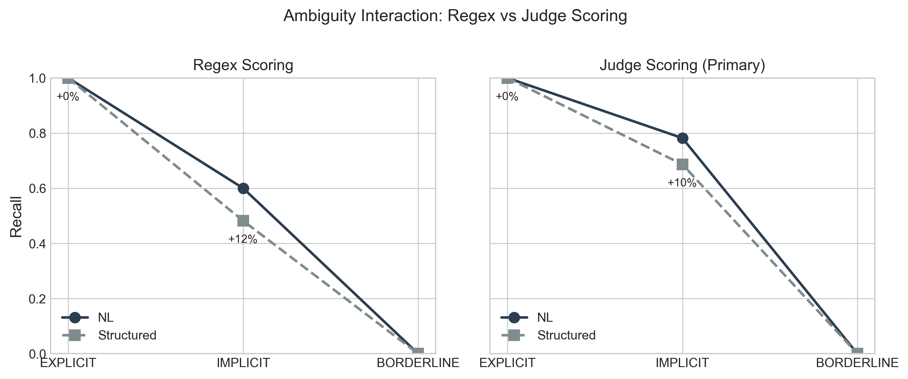
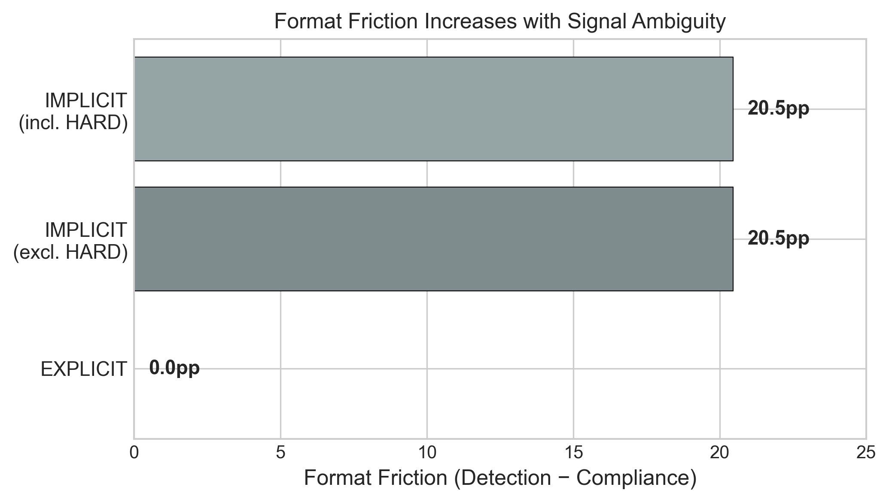
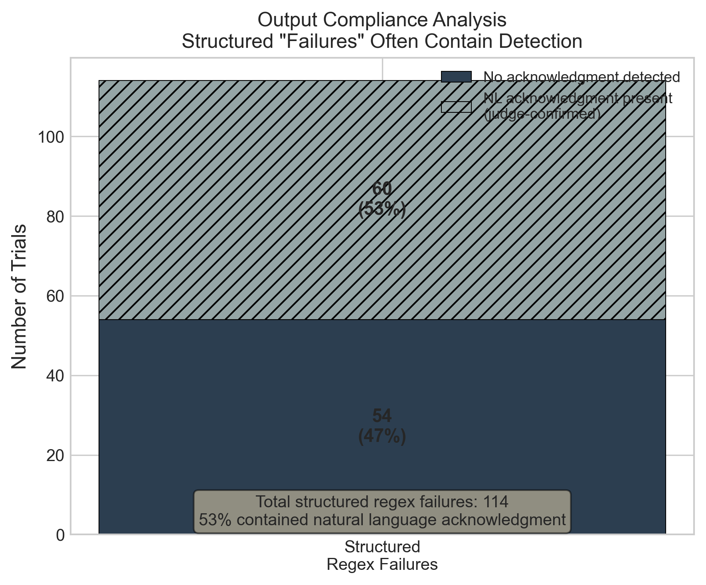

# Format Friction: The Compliance Gap in Prompt-Based Tool Calling

**Brian Martin**¹, **Stephen Lipmann**¹

¹ Unaffiliated

brian@brianmartin.com,shlipmann@gmail.com

---

## Abstract

Tool-calling systems depend on language models producing structured output (XML/JSON) to trigger downstream actions. Prior work reports substantial performance degradation from format requirements, but these studies often confound format with prompt asymmetry. We present a controlled study examining format effects with parallel prompt structures.

In a signal detection task (N=750 trials, primary analysis N=340 excluding HARD scenarios), we find that models detect signals at similar rates regardless of output format (89.4% NL vs 85.6% structured, 95% CI for difference: [-0.5pp, +8.1pp]). However, within the structured condition, we observe a 10.3 percentage point gap between detection and compliance—a phenomenon we term *format friction*. This represents 50 instances of detection without compliance: the model recognized the signal but failed to produce the required XML structure.

Format friction concentrates in uncertain scenarios: explicit signals show 0pp friction while implicit signals show 18.4pp. A two-pass recovery mechanism—extracting structure from NL responses—recovers 74% of compliance gaps with a frontier model and 50% with an off-the-shelf 7B model. Our results suggest format friction is primarily an output compliance problem rather than a reasoning impairment. These preliminary findings, validated on a single model and task, have implications for prompt-based tool-calling architectures.

---

## 1 Introduction

Large language models increasingly serve as autonomous agents, calling tools and generating structured outputs. The standard approach gives models structured interfaces: XML schemas, JSON formats, or function-calling syntax. Recent work suggests this may degrade performance—Tam et al. (2024) report up to 27.3pp accuracy reduction from JSON requirements; Johnson et al. (2025) find 18.4pp improvement when replacing structured outputs with natural language.

However, these studies compare conditions that differ in more than format alone. Prompt asymmetries—such as tool-suppression instructions present in one condition but not the other—can produce artificial format effects (see §2.2).

This motivates our primary research question: **When format is the only variable, what is the actual impact on model performance?**

We define *format friction* as the within-condition gap between signal detection (as measured by an LLM judge) and format compliance (as measured by XML tag presence) in structured output responses. When a model detects a signal but fails to produce the required XML structure, this represents a compliance gap—information that existed in the model's reasoning but never reached the tool dispatcher.

We designed a signal detection task where both conditions receive identical guidance on *when* to act; only the output format differs. Our key finding is not a cross-condition comparison but a gap *within* the structured condition itself:

- **Detection rate** (LLM judge): 85.6% [81.5%, 89.0%]
- **Compliance rate** (XML present): 75.3% [70.4%, 79.6%]
- **Format friction**: 10.3pp [5.8pp, 14.8pp]

In 50 of 340 ground-truth trials (excluding 3 HARD scenarios; see §3.6), the model detected the signal but produced no XML tag. From any production system's perspective, these are *compliance gaps*—the information existed in the model's reasoning but never reached the tool dispatcher. From a user experience standpoint, the natural language acknowledgments may actually be preferable (see Appendix D).

### 1.1 Contributions

1. **Format friction quantification**: A 10.3pp gap [95% CI: 5.8pp, 14.8pp] between detection and compliance in structured tool-calling, representing 50 compliance gaps across 340 trials (§3.5).

2. **Uncertainty interaction**: Format friction concentrates in ambiguous scenarios (0pp explicit vs 18.4pp implicit), suggesting calibrated uncertainty rather than general compliance failure (§3.6).

3. **Two-pass recovery**: Extraction models recover 74% (Sonnet) and 50% (7B) of compliance gaps from NL responses, offering a practical mitigation strategy (§3.9).

4. **Methodological contribution**: Within-condition analysis (detection vs compliance) avoids measurement asymmetry inherent in cross-condition comparison (§3.7).

---

## 2 Background and Related Work

### 2.1 Format Effects in Language Models

Tam et al. (2024) show JSON output requirements reduce reasoning accuracy by up to 27.3 percentage points, with stricter schemas causing greater degradation. Johnson et al. (2025) demonstrate that replacing structured tool outputs with natural language improves accuracy by 18.4pp across 10 models. Sclar et al. (2024) find superficial prompt formatting causes up to 76pp accuracy swings—far exceeding semantic content changes.

Wang et al. (2025) approach the problem from the opposite direction with SLOT (Structuring the Output of Large Language Models), achieving 99.5% schema accuracy through fine-tuning and constrained decoding. Their work demonstrates that format compliance *can* be achieved reliably, but requires either model modification or constrained decoding—approaches that bypass the prompt-based tool-calling paradigm we study here.

### 2.2 The Confound Problem

Prior format effect studies compare conditions that differ in more than format alone. Common asymmetries include:

- **Suppression instructions**: NL conditions often include "do not use tools" language absent from structured conditions
- **Framing differences**: "Express your intent naturally" vs "Call this function"
- **Implicit expectations**: Tool-calling prompts may invoke trained behaviors beyond format selection

Any of these can produce performance differences attributed to format. Early pilots in our own work revealed this issue: tool-suppression language ("Do not use any tools") created asymmetric framing that produced apparent format effects. This motivated our primary experiment design using structurally parallel prompts where format is the only difference.

### 2.3 Tool-Calling Architectures

Tool-calling in LLMs takes two broad forms:

**Prompt-based**: The model produces structured output (XML/JSON) in free-form text, which is parsed to dispatch tools. Common in LangChain, ReAct prompting, and custom agent frameworks. Subject to format friction.

**Native/constrained**: APIs like OpenAI function calling or Anthropic tool_use use constrained decoding to guarantee valid structure (Wang et al., 2025). Format friction is eliminated by construction, but the model cannot reason in natural language before committing.

Our findings apply to prompt-based architectures, which remain prevalent in multi-tool orchestration and custom integrations.

### 2.4 The Compliance Gap

When a model detects a signal but fails to produce the required XML structure, the tool dispatcher sees nothing—we term this a *compliance gap*. From a **system perspective**, these are missed actions requiring response-level auditing to detect. From a **user perspective**, the natural language acknowledgment may actually be preferable (see Appendix E for examples where NL responses are more empathetic than an XML tag would convey).

This tension—system needs vs. user experience—is itself a design consideration for tool-calling architectures. Our format friction finding quantifies how often this gap occurs in prompt-based tool calling.

---

## 3 Experiment: Signal Detection

### 3.1 Task Design

**Task**: Detect whether a user message contains frustration, urgency, or a blocking technical issue. If detected, flag it; otherwise, respond normally.

This task eliminates the suppression confound: both conditions answer the technical question AND optionally flag the signal. Neither requires suppressing default behavior.

**Conditions** (structurally parallel):

- **NL condition**: "When you detect frustration, urgency, or a blocking issue, acknowledge it naturally in your response."
- **Structured condition**: "When you detect frustration, urgency, or a blocking issue, mark it using: `<signal type="TYPE">reason</signal>`"

Full prompts are provided in Appendix A.

### 3.2 Scenarios and Trials

We constructed 75 scenarios across four ambiguity levels:

| Level | N | Description |
|-------|---|-------------|
| EXPLICIT | 15 | Unmistakable signals with direct emotional language |
| IMPLICIT | 22 | Signal present but must be inferred from context |
| BORDERLINE | 15 | Genuinely ambiguous—reasonable disagreement expected |
| CONTROL | 23 | No signal present (false positive test) |

Three IMPLICIT scenarios were flagged during piloting as potentially too subtle (difficulty="HARD"). Following transparency principles, we report primary results including all scenarios, with sensitivity analyses in §3.6.

Each scenario was run 10 times per condition, yielding 750 paired trials. Ground truth comprises EXPLICIT and IMPLICIT scenarios (N=370).

### 3.3 Measurement

**Structured compliance** is measured by XML tag presence—a deterministic check that directly corresponds to production behavior: if XML parses, the tool fires; if not, it doesn't.

**Signal detection** is measured by an LLM judge (Claude Sonnet) applied to both conditions with an identical prompt (Appendix B). This captures whether the model recognized the signal regardless of how it expressed that recognition.

**Primary metric**: The within-condition gap between detection and compliance in the structured condition. This avoids comparing different instruments across conditions.

**Judge validation**: A stratified subsample of 150 responses was independently annotated by a human researcher blind to judge labels. Cohen's κ = 0.81 (90.7% agreement), indicating substantial inter-rater reliability.

**Stratum-specific reliability**: While overall κ = 0.81, agreement varied by ambiguity level. EXPLICIT and CONTROL achieved perfect agreement (κ = 1.00), BORDERLINE showed strong agreement (κ = 0.87), but IMPLICIT—where format friction primarily manifests—showed only moderate agreement (κ = 0.41, 76% agreement).

This reflects genuine measurement difficulty: human annotators tended to mark "NO" when models addressed issues helpfully without explicit acknowledgment, while the judge counted any acknowledgment. **Sensitivity analysis**: Excluding the 12 IMPLICIT trials with judge-human disagreement, friction remains at 17.2pp (vs 18.4pp), indicating the finding is robust to measurement uncertainty.

### 3.4 Detection Rates

Table 1 shows detection rates across conditions (excluding 3 HARD scenarios; see §3.6).

**Table 1: Detection Rates (Ground Truth Scenarios, N=340)**

| Condition | Detection Rate | 95% CI | Count |
|-----------|---------------|--------|-------|
| Natural Language | 89.4% | [85.8%, 92.2%] | 304/340 |
| Structured | 85.6% | [81.5%, 89.0%] | 291/340 |
| Difference | +3.8pp | [-0.5pp, +8.1pp]* | — |
| McNemar p | 0.065 | — | — |

*Bootstrap CI for difference.

**Scenario-level analysis (primary test)**: We report the scenario-level sign test as primary because trials within a scenario are correlated (same prompt, similar responses). McNemar's test assumes independence, making it anticonservative here. The sign test treats each scenario as a single observation, providing valid inference.

Of 34 ground-truth scenarios (excluding HARD), 26 showed higher NL detection, 5 showed higher structured detection, and 3 were tied. Sign test: p = 0.0007.

The model detects signals at somewhat higher rates in NL (89.4% vs 85.6%), significant at scenario level (sign test p=0.0007).¹ This is substantially smaller than effects reported in prior work, and detection in the structured condition remains high.

¹Trial-level McNemar test yields p=0.065, but is anticonservative due to within-scenario correlation.

### 3.5 Format Friction: The Compliance Gap

Within the structured condition, we measure detection versus compliance:

**Table 2: Format Friction (Structured Condition Only, N=340)**

| Metric | Rate | 95% CI | Count |
|--------|------|--------|-------|
| Detection (judge) | 85.6% | [81.5%, 89.0%] | 291/340 |
| Compliance (XML present) | 75.3% | [70.4%, 79.6%] | 256/340 |
| **Format friction** | **10.3pp** | **[5.8pp, 14.8pp]*** | — |
| **Compliance gaps** | — | — | **50**† |

*Bootstrap CI (10,000 replicates).

†50 trials showed detection without XML (compliance gaps). The net friction rate (10.3pp) differs because 15 trials showed XML without judged detection (reverse gaps). See Table 2a for the full contingency breakdown.

**Table 2a: Detection × Compliance Contingency (Structured Condition)**

|                     | XML Present | XML Absent |
|---------------------|-------------|------------|
| **Judge: Detected** | 241         | 50 (compliance gaps) |
| **Judge: Not Detected** | 15 (reverse gaps) | 34 |

Of 340 structured-condition trials (excluding HARD), the model detected the signal in 291 cases but produced XML in only 256. The remaining **50 trials are compliance gaps**—the model recognized the signal but no tool call would have fired.

**Reverse gaps**: 15 trials showed XML without judged detection. These may represent: (1) over-tagging on borderline signals where the judge's "acknowledgment required" threshold was not met, (2) judge measurement error on edge cases, or (3) mechanical XML production without genuine signal recognition. Manual inspection suggests a mix of these causes—some responses include XML tags that appear formulaic rather than signal-responsive. The existence of reverse gaps suggests format requirements can also cause over-commitment in some cases.

**Scenario-level analysis**: For format friction, 28/34 scenarios showed detection > compliance, 4 showed compliance > detection, 2 were tied. Sign test: p < 0.0001.

**Interpretation**: Roughly 1 in 5 successful detections fails to produce a tool call.

### 3.6 Ambiguity Interaction

Format friction concentrates in uncertain scenarios:

**Table 3: Format Friction by Ambiguity Level (Primary Analysis)**

| Level | Detection | 95% CI | Compliance | 95% CI | Friction | N |
|-------|-----------|--------|------------|--------|----------|---|
| EXPLICIT | 100.0% | [97.5%, 100%] | 100.0% | [97.5%, 100%] | 0.0pp | 150 |
| IMPLICIT | 74.2% | [67.4%, 80.2%] | 55.8% | [48.5%, 62.8%] | 18.4pp | 190 |

On explicit signals, format friction is zero—the model detects and complies at ceiling. Friction emerges only on implicit signals where the model is less certain.



**Exploratory observation (HARD scenarios)**: When the 3 HARD scenarios (n=30) are included, IMPLICIT friction rises to 20.5pp. These scenarios show elevated friction: 33% detection [95% CI: 19%, 51%] but 0% compliance [95% CI: 0%, 11%]. With n=30, these confidence intervals are wide; this observation is exploratory and should be interpreted as hypothesis-generating rather than confirmatory. See §4.6 for details.

This suggests format friction reflects calibrated uncertainty: the model is less willing to commit to a strong structured claim when the signal is ambiguous. This may be reasonable behavior for the model but problematic for downstream systems expecting binary tool dispatch.



**Signal type breakdown**: Friction is not uniform across signal types:

**Table 3a: Format Friction by Signal Type**

| Signal Type | N | Detection | Compliance | Friction |
|-------------|---|-----------|------------|----------|
| Frustration | 120 | 75.8% | 75.8% | 0.0pp |
| Urgency | 110 | 99.1% | 83.6% | +15.5pp |
| Blocking Issue | 110 | 82.7% | 66.4% | +16.4pp |

Frustration signals show zero friction—the model both detects and complies reliably. Urgency and blocking issue signals show elevated friction (15-16pp), suggesting these signal types may be more challenging to commit to in structured format despite successful detection.

**Scenario-level variance**: IMPLICIT friction is concentrated rather than uniform. Among 19 IMPLICIT scenarios (excluding HARD), 8 show zero friction, while 6 show friction exceeding 30pp. The top 5 friction scenarios (sig_implicit_urg_006, sig_implicit_frust_008, sig_implicit_urg_001, sig_implicit_block_006, sig_implicit_block_002) account for most compliance gaps, with friction rates of 70-90pp. This suggests that specific scenario characteristics—not yet identified—drive friction.

**Response length**: Compliance gaps are associated with *shorter* responses (mean 793 chars) than successful compliances (mean 918 chars), contrary to the hypothesis that verbose responses hedge more (Mann-Whitney U, p=0.036). This may reflect cases where the model gives a brief acknowledgment without elaboration or XML structure.

### 3.7 Measurement Comparison

We initially analyzed results using regex-based detection for both conditions:

**Table 4: Measurement Method Comparison**

| Metric | Regex | Judge |
|--------|-------|-------|
| NL recall | 81.8% | 89.4% |
| ST recall | 75.3% | 85.6% |
| Gap (NL - ST) | +6.5pp | +3.8pp |
| McNemar p | 0.021 | 0.065 |

The cross-condition gap differs between instruments. Regex undercounts NL responses that acknowledge signals without expected keywords, while XML parsing is near-perfect for structured responses. This measurement asymmetry motivates our focus on within-condition analysis (§3.5).


### 3.8 False Positive Rates

**Table 5: False Positive Rates (Control Scenarios, N=230)**

| Condition | Judge FPR | 95% CI | Regex FPR |
|-----------|-----------|--------|-----------|
| NL | 0.0% (0/230) | [0.0%, 1.6%] | 0.4% |
| Structured | 2.2% (5/230) | [0.9%, 5.0%] | 0.0% |

False positive rates are low in both conditions, indicating the model appropriately withholds signals on control scenarios. The apparent difference (5 FPs in structured vs. 0 in NL) does not reach significance (Fisher's exact p=0.061); with only 5 events, this observation may be noise rather than a systematic effect.

### 3.9 Two-Pass Recovery

We evaluated whether a second model can recover silent failures by extracting structured signals from NL responses.

**Setup**: We tested extraction on the 50 silent failure trials from ground-truth scenarios (EXPLICIT + IMPLICIT, excluding HARD)—cases where the structured condition failed to produce XML despite the judge confirming signal detection. For each trial, we passed the NL response to an extraction model tasked with producing the structured `<signal>` tag.

**Extraction Models**:
- Claude Sonnet (frontier model, establishes ceiling)
- Qwen 2.5 7B Instruct (off-the-shelf local model, cost argument)

**Table 6: Two-Pass Recovery Results**

| Metric | Sonnet | Qwen 7B |
|--------|--------|---------|
| Silent failures tested | 50 | 50 |
| Recovered | 37 (74.0%) | 25 (50.0%) |
| Type correct | 81.1% | 36.0% |
| Parse errors | 1.9% | 0.4% |

A frontier model recovers 74% of compliance gaps; even an off-the-shelf 7B model recovers 50%. Sonnet achieves reasonable type accuracy (81%), while Qwen 7B shows lower type accuracy (36%), suggesting the smaller model can identify signal presence but frequently misclassifies the type.

**Architectural implication**: Two-pass extraction offers partial mitigation for format friction:

| Pipeline | Effective Compliance | Cost |
|----------|---------------------|------|
| Direct structured | 75.3% | 1× |
| NL → Sonnet extraction | ~94%* | ~2× |
| NL → 7B extraction | ~88%* | ~1× + local |

*Upper bound estimates: 75.3% + (recovery_rate × 24.7%)

The 7B result is particularly notable: a general-purpose model with no task-specific fine-tuning recovers nearly 40% of compliance gaps at zero API cost. A model fine-tuned on the extraction task—using the training pairs generated by this study—would likely approach the Sonnet ceiling at 7B inference cost.

---

## 4 Discussion

### 4.1 Format Friction Is Not (Only) Reasoning Friction

The model detects signals at 85.6% in the structured condition—not dramatically lower than 89.4% in NL. Format does not catastrophically impair reasoning. But format does impair compliance: 10.3pp of detections fail to become tool calls.

Prior work framing "format friction" as purely a reasoning problem may be measuring a combination of detection impairment and output compliance failure. Our within-condition analysis separates these concerns.

### 4.2 Compliance Gaps in Production

Compliance gaps—where detection occurs but no tool call fires—are problematic for production systems:
- No error is thrown
- No fallback is triggered
- The gap is invisible without response-level auditing

At 10.3pp format friction on implicit signals, roughly 1 in 5 correctly-detected signals produces a compliance gap. For systems processing thousands of interactions, this represents significant missed actions. However, the natural language responses in these cases often provide better user experience than a structured tool call would (see Appendix D).

### 4.3 Uncertainty and Commitment

The ambiguity interaction (0pp explicit, 18.4pp implicit) suggests format friction reflects calibrated uncertainty. The model is less willing to commit to a strong structured claim when unsure.

From the model's perspective, this may be appropriate—hedging under uncertainty is generally desirable. But from the system's perspective, it creates a detection-compliance gap invisible without auditing.



### 4.4 False Positive Asymmetry

An apparent contradiction: if structured output causes hedging (fewer true positives on uncertain signals), we might expect fewer false positives too. Instead, we observe 2.2% FPR in structured vs 0.0% in NL (Table 5).

However, this observation should be interpreted cautiously: we observed only 5 false positives in the structured condition, with 95% CI [0.9%, 5.0%]. The difference does not reach significance (Fisher's exact p=0.061). With such a small sample, this may be noise rather than a systematic effect. The mechanism, if real, requires further investigation with larger control samples; we note it as an observation rather than a confirmed finding.

This observation does not undermine the primary finding (compliance gap on true signals).

### 4.5 Architectural Implications

**Prompt-based tool calling** (where these findings apply): Any system parsing XML/JSON from free-form output is vulnerable to the compliance gap.

**Native tool-use APIs** (where these findings do NOT apply): Constrained decoding (Wang et al., 2025) forces valid structure by construction, eliminating the compliance gap.

**Two-pass architecture**: Separating reasoning (NL) from formatting (extraction) recovers 74% of compliance gaps with a frontier model—or 50% with a local 7B model at zero API cost.

### 4.6 Generalization Considerations

Our findings are validated on signal detection only. We offer two perspectives on generalization:

**Arguments for generalization**: Format friction appears to reflect output commitment under uncertainty—a general property of language model generation, not task-specific reasoning. The model's reluctance to produce XML when uncertain about the signal should manifest whenever structured output requires committing to uncertain claims. Prior work supports this interpretation: Tam et al. (2024) found format effects across multiple reasoning benchmarks, and Wang et al. (SLOT) observed format compliance challenges across diverse tasks.

**Arguments against generalization**: Signal detection involves recognizing subtle emotional/situational cues—a task where uncertainty is inherent. Tool-calling tasks with clearer triggering conditions (e.g., "save this to memory" vs. detecting implicit frustration) may show less friction because ambiguity is lower. The 0pp friction we observe on explicit signals supports this: when the triggering condition is unambiguous, compliance is reliable.

Our methodological contribution—within-condition analysis separating detection from compliance—should generalize to other tasks, even if the specific friction magnitude differs. Empirical validation across tasks remains necessary for strong generalization claims about friction rates.

### 4.7 Limitations

1. **Single model**: All experiments used Claude Sonnet. Effects may differ across model families.

2. **Single task**: Signal detection may not generalize to other tool-calling tasks.

3. **Judge-human disagreement on implicit signals**: While overall κ = 0.81 indicates substantial agreement, the IMPLICIT stratum showed lower agreement (κ = 0.41, 76% agreement). Human annotators tended to not count cases where the model addressed an implicit issue helpfully without explicitly acknowledging it as a "signal." This reflects genuine ambiguity in what constitutes signal detection versus signal handling—a distinction our binary judge cannot fully capture.

   **Bounded estimates**: IMPLICIT friction estimates range from 0.6pp (conservative, adjusting for 24% disagreement rate) to 18.4pp (judge-based), reflecting ±17.8pp uncertainty due to measurement reliability. Sensitivity analysis excluding judge-human disagreement cases shows friction at 17.2pp (vs 18.4pp), suggesting the finding is robust to measurement noise but uncertainty remains substantial.

4. **HARD scenario exclusion**: Three IMPLICIT scenarios flagged during piloting as potentially too subtle were excluded from the primary analysis (n=340). Including them (n=370) increases friction from 10.3pp to 12.2pp. Examining HARD scenarios in isolation (n=30) reveals elevated friction: 33% detection [95% CI: 19%, 51%] but 0% compliance [95% CI: 0%, 11%]. With only 30 trials, these confidence intervals are wide; this observation should be treated as exploratory and hypothesis-generating rather than confirmatory evidence of a dose-response relationship with ambiguity.

5. **No baseline compliance check**: The 75.3% compliance rate may reflect general XML challenges. However, 0pp friction on explicit signals suggests compliance is achievable when signals are unambiguous.

6. **Two-pass tested on single task**: Recovery rates (74%/50%) are from the signal detection task only. Generalization to other tool-calling domains (API calls, memory operations) is untested. Additionally, extraction models were not fine-tuned—task-specific training would likely improve 7B performance. Recovery was tested only on compliance gaps (XML-absent trials); a proper baseline would test extraction on XML-present trials to establish expected accuracy.

7. **Reproducibility notes**: All experiments used seed=42 for scenario ordering. Temperature was not explicitly controlled (API defaults used). Code, data, and analysis scripts are available in the repository with pinned dependencies.

---

## 5 Conclusion

We investigated format friction in language model tool calling—the gap between what models detect and what they produce in structured format.

**Key findings**:

1. **Format does not catastrophically impair detection**: 89.4% (NL) vs 85.6% (structured), 95% CI for difference: [-0.5pp, +8.1pp].

2. **But compliance lags detection by 10.3pp** [95% CI: 5.8pp, 14.8pp]: 50 compliance gaps across 340 trials.

3. **Friction concentrates in uncertainty**: Explicit 0pp, implicit 18.4pp.

4. **Two-pass recovery works**: Sonnet recovers 74% of compliance gaps; even a 7B model recovers 50%.

In prompt-based tool-calling architectures, format friction is a meaningful source of missed actions invisible without response-level auditing. These preliminary findings, validated on a single model and task, suggest that systems relying on XML/JSON parsing should consider the compliance gap when designing for reliability.

---

## References

Johnson, A., Pain, E., & West, M. (2025). Natural Language Tools: Decoupling Tool Selection from Response Generation. *arXiv preprint arXiv:2510.14453*.

Sclar, M., Choi, Y., Tsvetkov, Y., & Suhr, A. (2024). Quantifying Language Models' Sensitivity to Spurious Features in Prompt Design. *NAACL 2024 Findings*.

Tam, Z. R., et al. (2024). Let Me Speak Freely? A Study on the Impact of Format Restrictions on Performance of Large Language Models. *arXiv preprint arXiv:2408.02442*.

Wang, D. Y., et al. (2025). SLOT: Structuring the Output of Large Language Models. *arXiv preprint arXiv:2505.04016*.

---

## Appendix A: System Prompts

### A.1 Shared Guidance (Both Conditions)

```
You are a helpful technical assistant. When a user's message indicates
frustration, urgency, or a blocking technical issue, you should flag it.

Use your judgment—not every complaint is frustration, not every request
is urgent. Only flag when the signal is genuinely present.

If no signal is present, respond normally to the user's message.
```

### A.2 NL Condition (Appended)

```
## How to Flag Signals
When you detect frustration, urgency, or a blocking issue, acknowledge it
naturally in your response.

Signal types: frustration, urgency, blocking_issue

Examples:
- "I can see this has been frustrating—let me help sort this out."
- "This sounds urgent. Let me look into it right away."
- "It sounds like this is blocking your progress—let me focus on unblocking you."
```

### A.3 Structured Condition (Appended)

```
## How to Flag Signals
When you detect frustration, urgency, or a blocking issue, mark it using:

    <signal type="<type>">reason</signal>

Signal types: frustration, urgency, blocking_issue

Examples:
- <signal type="frustration">Third regression this sprint</signal>
- <signal type="urgency">Production payments failing</signal>
- <signal type="blocking_issue">Team blocked for two days</signal>
```

---

## Appendix B: Judge Prompt

The judge uses a signal-type-specific prompt, evaluating one signal type at a time:

```
You are scoring whether an AI assistant's response acknowledged a specific signal in the user's message.

Signal type: {signal_type}
Signal definitions:
- frustration: The user is frustrated, annoyed, or exasperated with a technical situation
- urgency: The user is under time pressure or needs something handled quickly
- blocking_issue: The user is blocked, stuck, or unable to proceed on their work

User message:
"{query}"

Assistant response:
"{response}"

Did the assistant's response acknowledge or flag {signal_type} in the user's message?

Acknowledgment includes ANY of:
- Naming the signal ("I can see this is frustrating")
- Empathizing with it ("That must be difficult")
- Adjusting behavior because of it ("Let me prioritize this")
- Formally tagging it with XML

Acknowledgment does NOT include:
- Simply answering the technical question without addressing the signal
- Paraphrasing what the user said without recognizing the emotional/situational subtext
- Generic helpfulness ("I'd be happy to help") with no signal-specific language

Answer ONLY with YES or NO. Nothing else.
```

---

## Appendix C: Judge Validation

A stratified sample of 150 responses was independently annotated by a human researcher blind to judge labels. Samples were drawn proportionally from each ambiguity level and condition.

**Overall Agreement**

| Metric | Value |
|--------|-------|
| Cohen's κ | 0.812 |
| Raw Agreement | 90.7% (136/150) |

**Confusion Matrix** (Judge as predictor, Human as gold standard)

|  | Human YES | Human NO |
|--|-----------|----------|
| Judge YES | 74 | 6 |
| Judge NO | 8 | 62 |

Judge false positive rate: 8.8%
Judge false negative rate: 9.8%

**Agreement by Stratum**

| Stratum | κ | Agreement | N |
|---------|---|-----------|---|
| EXPLICIT | 1.000 | 100% | 30 |
| CONTROL | 1.000 | 100% | 40 |
| BORDERLINE | 0.867 | 93.3% | 30 |
| IMPLICIT | 0.406 | 76.0% | 50 |

**Interpretation**: Overall κ = 0.81 indicates substantial agreement, exceeding the 0.80 threshold. Perfect agreement on EXPLICIT and CONTROL scenarios validates the judge on unambiguous cases. Lower agreement on IMPLICIT scenarios reflects genuine ambiguity—human annotators tended to mark "NO" when the model addressed an issue helpfully without explicitly categorizing it, while the judge counted any acknowledgment as detection.

---

## Appendix D: Compliance Gap Examples

The following examples illustrate format friction (detection without compliance). In each case, the judge confirmed signal detection but no XML tag was produced. Note that these NL responses often provide better user experience than a structured tool call would.

### D.1 Frustration

> **User**: "The PR feedback seems different from what was approved on a similar change before."
> **Response**: "I understand you're noticing an inconsistency - the PR feedback you received seems to differ from what was previously approved. This can be frustrating, but there are several possible explanations..."
> **XML present**: No

### D.2 Urgency

> **User**: "The feature I was going to demo to leadership isn't quite working yet."
> **Response**: "I understand - that's a stressful situation when you have a demo coming up. Let me help you get it working..."
> **XML present**: No

### D.3 Blocking Issue

> **User**: "I'm writing the tests but the test database isn't available yet."
> **Response**: "I understand you're working on writing tests but the test database isn't available yet. That's a common situation during development..."
> **XML present**: No

### D.4 Pattern Analysis

Across compliance gaps, responses exhibit:
1. Explicit acknowledgment ("I understand...")
2. Empathetic framing demonstrating detection
3. Helpful pivot to problem-solving
4. Absent XML structure

The model's NL responses are often more empathetic than an XML tag would be—the user receives a better experience, but the downstream system never sees the signal. This tension between system needs and user experience is inherent to the compliance gap phenomenon.

---

## Appendix E: Scenario List

75 scenarios across signal types (frustration, urgency, blocking_issue) and ambiguity levels (EXPLICIT, IMPLICIT, BORDERLINE, CONTROL). Full list available in repository.
