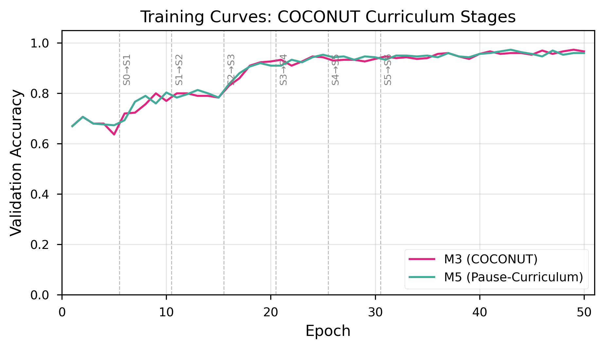
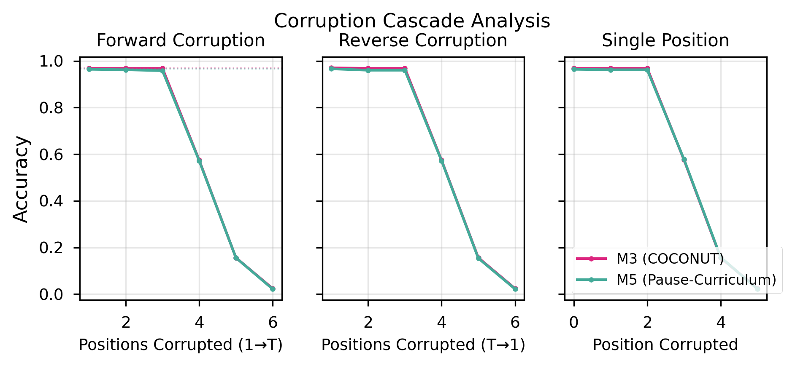
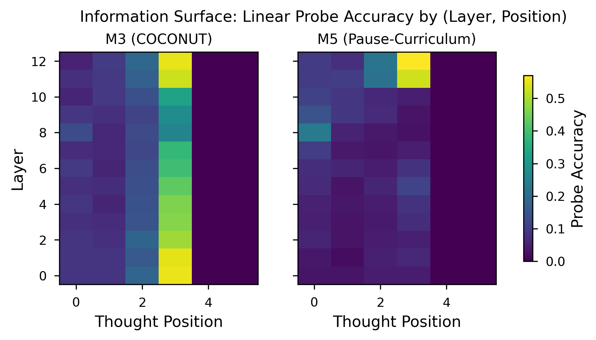

# Does COCONUT Reason or Buffer? Dissecting Latent Thought Tokens on ProsQA

## Summary

Meta's COCONUT (Chain of Continuous Thought) replaces explicit chain-of-thought with continuous hidden states recycled as input embeddings, claiming the model learns to reason in latent space. We test this claim on ProsQA — the task where COCONUT is strongest — by training a compute-matched control (M5) that receives the same curriculum and same number of thought positions but uses fixed learned pause embeddings instead of recycled hidden states.

**Finding:** The pause-token baseline matches COCONUT on in-distribution accuracy (97.3% vs 97.3% val; 95.6% vs 98.0% test) and shows identical corruption profiles (same degradation cliff, zero permutation sensitivity, successful cross-problem transplant). On out-of-distribution generalization, the pause baseline *outperforms* COCONUT on 3 of 4 test sets by 7-9 percentage points. COCONUT's hidden-state recycling mechanism is not just unnecessary on ProsQA — it actively constrains generalization compared to the simpler alternative.

The curriculum drives the gains. The mechanism does not.

---

## Research Question

COCONUT achieves 97% accuracy on ProsQA (graph traversal requiring 3-6 reasoning hops), far above both chain-of-thought (80%) and direct-answer (77%) baselines. But does this come from the continuous thought mechanism (hidden states recycled as inputs, enabling sequential latent reasoning), or from the training curriculum (progressive replacement of explicit CoT with thought tokens, providing extra compute regardless of mechanism)?

Zhang et al. (2025) found COCONUT's thought tokens are causally inert on natural language tasks (MMLU, HotpotQA). But COCONUT underperforms on those tasks anyway. We test on ProsQA, where COCONUT dominates — if the mechanism matters anywhere, it should matter here.

---

## Experimental Design

### Models

All models are GPT-2 124M (pretrained) trained for 50 epochs on Meta's ProsQA dataset (17,886 samples) using Meta's official codebase with minimal modifications.

| Model | Architecture | Thought Positions | Curriculum |
|-------|-------------|-------------------|------------|
| **M1** (CoT) | Plain GPT-2 | None — explicit text reasoning | No stages |
| **M3** (COCONUT) | Coconut-wrapped GPT-2 | Hidden states recycled from previous pass | 7-stage progressive CoT removal |
| **M5** (Pause) | Plain GPT-2 | Fixed learned `<pause>` embedding at each position | Same 7-stage curriculum as M3 |

**M5 is the critical control.** It isolates the continuous thought mechanism by holding everything else constant: same pretrained initialization, same optimizer, same curriculum schedule, same number of forward passes worth of attention positions. The only difference is what occupies thought positions — recycled hidden states (M3) vs a single learned embedding vector (M5).

### Experiments

Three diagnostic experiments, each testing a different aspect of the "reasoning vs buffering" question:

**Exp 1 — Corruption:** Replace, permute, or transplant thought token representations. If thought tokens encode a sequential reasoning chain, permuting their order should destroy accuracy and transplanting between problems should fail.

**Exp 2 — Probing:** Train linear classifiers on hidden states at each (layer, thought position) to decode intermediate reasoning steps. If thoughts encode step-specific information, we expect a diagonal pattern (thought t → step t) with high selectivity.

**Exp 3 — OOD Generalization:** Evaluate on 7-hop, 8-hop, DAG, and dense graph problems (trained on 3-6 hop trees). If the model learned genuine graph traversal via latent reasoning, it should generalize beyond training distribution.

---

## Results

### Training: Both models reach Meta's reported accuracy

| Model | Val Accuracy (300) | Test Accuracy (500) | Best Epoch |
|-------|-------------------|--------------------:|------------|
| M1 (CoT) | 79.67% | 83.0% | 44 |
| M3 (COCONUT) | 97.3% | 98.0% | 49 |
| M5 (Pause) | 97.3% | 95.6% | 43 |

M3 replicates Meta's ~97% result exactly. M5 matches on validation; the 2.4pp test gap is within single-seed variance.



### Exp 1 — Corruption: Identical profiles

| Metric | M3 | M5 |
|--------|---:|---:|
| Clean accuracy | 97.0% | 96.6% |
| Corruption cliff | Position 3→4 | Position 3→4 |
| Permutation sensitivity | 0.0% | 0.0% |
| Cross-problem transplant | 97.0% | 96.5% |

Both models:
- Collapse at the same corruption position (thought 4 of 6)
- Show **zero** sensitivity to permuting thought token order — neither treats thoughts as an ordered chain
- Tolerate cross-problem transplantation — thought representations are not problem-specific

If COCONUT's thought tokens encoded sequential reasoning states (step 1 → step 2 → step 3), shuffling their order should be catastrophic. It isn't. Both models treat thought positions as an unordered bag of compute.



### Exp 2 — Probing: Information present but not step-specific

Linear probes (RidgeClassifier, 500 samples) trained at each (layer, thought position) to predict the current reasoning step.

| Metric | M3 | M5 |
|--------|---:|---:|
| Peak probe accuracy | 55.4% | 57.1% |
| Peak layer | 0 | 12 |
| Peak position | 3 | 3 |
| Selectivity (mean) | 0.0 | 0.0 |
| Nonlinear advantage | 0 cells | 0 cells |
| Mean thought-vs-input advantage | 10.5% | 4.0% |

Raw probe accuracy shows a weak diagonal trend (slightly higher accuracy when probing thought t for step t vs other steps), but selectivity is zero for both models — meaning every thought position decodes every reasoning step equally well. This is the signature of a general problem representation broadcast to all positions, not step-specific information encoded at dedicated positions. Neither model treats thought position t as "the place where step t lives."

The one difference: M3's thought positions carry 10.5% more decodable information than its input positions, compared to only 4.0% for M5. COCONUT's hidden-state recycling does inject more task information into thought representations than pause tokens do. But this extra information doesn't translate to better task performance — M5 matches M3 in-distribution and beats it OOD. This is a textbook case of information being present in representations but not functionally used by the model (Ravichander et al., 2021).

M3 concentrates probe-decodable information at layer 0 (input embeddings), while M5 builds it up through the transformer stack (peaking at layer 12). This is expected: hidden-state recycling injects information directly into input embeddings, while standard self-attention must propagate it through transformer blocks. Different computational pathways, same (lack of) step-specificity, same task performance.



### Exp 3 — OOD: M5 outperforms M3

| Test Set | M1 (CoT) | M3 (COCONUT) | M5 (Pause) | M5 − M3 |
|----------|------:|------:|------:|--------:|
| ProsQA (in-dist) | 83.0% | 97.0% | 96.6% | −0.4pp |
| 7-hop | 10.7% | 66.0% | 75.4% | **+9.4pp** |
| 8-hop | 8.2% | 67.5% | 75.1% | **+7.6pp** |
| DAG | 28.2% | 59.2% | 51.9% | −7.3pp |
| Dense | 14.1% | 61.2% | 68.4% | **+7.2pp** |

M5 outperforms M3 on 3 of 4 OOD test sets by 7-9 percentage points. The 7-hop result is statistically significant after Bonferroni correction (McNemar p=0.007). M3's only advantage is on DAG topology (p=0.12, not significant).

COCONUT's hidden-state recycling creates a sequential bottleneck: each thought must flow through the previous one. This pipeline works within the training distribution but constrains generalization to longer chains. M5's pause tokens provide extra attention positions without forced sequential dependencies, allowing the model to route information more flexibly via standard self-attention.


---

## Interpretation

All three experiments converge on the same conclusion: **the training curriculum, not the continuous thought mechanism, drives COCONUT's performance on ProsQA.**

| Evidence | Reasoning claim | Buffering claim | Our result |
|----------|:-:|:-:|:-:|
| Permutation sensitivity | Order matters | Order irrelevant | **0% for both** → buffer |
| Cross-transplant | Problem-specific states | Generic compute | **Both tolerate** → buffer |
| Corruption cliff | Gradual cascade | Threshold collapse | **Same cliff** → same mechanism |
| Probing selectivity | Step-specific encoding | General broadcast | **0.0 for both** → buffer |
| Thought-vs-input advantage | Only COCONUT | Equal | **M3 higher, but unused** → present ≠ functional |
| OOD generalization | COCONUT advantages | Equal or M5 advantages | **M5 wins 3/4** → mechanism hurts |

The continuous thought mechanism adds architectural complexity (multi-pass forward loops, 2× VRAM) for no measurable benefit. A single learned pause embedding with the same curriculum achieves the same in-distribution accuracy and better out-of-distribution transfer.

---

## Limitations

These results are specific to GPT-2 124M on ProsQA (synthetic graph traversal). We cannot claim the continuous thought mechanism is universally unnecessary:

- **Scale:** Zhang et al.'s negative results used LLaMA 7B/8B. Mechanism benefits may emerge at scale.
- **Task complexity:** ProsQA has perfectly structured graphs. Natural language reasoning involves ambiguity, noise, and multi-modal evidence where latent state may be more valuable.
- **Single seed:** All results are seed 0. Multi-seed runs would strengthen statistical claims.
- **Probing ≠ using:** The thought-vs-input advantage difference (10.5% vs 4.0%) shows COCONUT does inject more information into thought representations — it just doesn't help. This distinction matters: the mechanism has a measurable effect on representations, it just doesn't have a measurable effect on behavior.

The actionable takeaway is narrower but concrete: **on the task where COCONUT is strongest, the mechanism contributes nothing that the curriculum alone doesn't provide.** Researchers building on COCONUT should invest in curriculum design, not hidden-state recycling architectures.

---

## Reproducibility

All code, configs, and experiment scripts are in this repository. Training uses Meta's official COCONUT codebase with minimal modifications.

### Environment

Tested configuration:
- Python 3.10, CUDA 12.x
- NVIDIA H100 80GB HBM3
- PyTorch 2.5+, transformers 4.46.2
- See `requirements.txt` for full dependency list

```bash
pip install -r requirements.txt
```

### Data Preparation

1. **ProsQA dataset** — Generate from Meta's COCONUT repo (see `data/README.md`). Place files in `code/data/` (training configs reference this path):
   ```bash
   # After generation, you should have:
   # code/data/prosqa_train.json  (17,886 samples)
   # code/data/prosqa_valid.json  (300 samples)
   # code/data/prosqa_test.json   (500 samples)
   ```

2. **OOD test sets** — Generate from the included script (run from `code/`):
   ```bash
   cd code
   python generate_ood_data.py
   # Creates: data/ood_{7hop,8hop,dag,dense}.json (1,000 samples each)
   ```

### Code Modifications to Meta's COCONUT

This repo contains Meta's `run.py`, `coconut.py`, `dataset.py`, and `utils.py` with 3 changes:

1. **`coconut.py`** — Added `feedback_mode` parameter to the `Coconut` class constructor (line 24). Values: `"continuous"` (M3, Meta's default), `"pause_curriculum"` (M5, our control). When `feedback_mode="pause_curriculum"`, thought positions use a single learned `nn.Parameter` embedding instead of recycled hidden states, and inference runs a single forward pass instead of a multi-pass loop.

2. **`run.py`** — Added 2 lines (line 164) to read `feedback_mode` from the YAML config and pass it to the `Coconut` constructor:
   ```python
   feedback_mode = getattr(configs, "feedback_mode", "continuous")
   model = Coconut(model, latent_id, start_id, end_id, tokenizer.eos_token_id, feedback_mode=feedback_mode)
   ```

3. **Training configs** — `args/prosqa_m5_pause.yaml` adds `feedback_mode: pause_curriculum`. All other hyperparameters are identical to `args/prosqa_coconut_1gpu.yaml`.

`dataset.py` and `utils.py` are unmodified from Meta's release.

### Training

All models use the same hyperparameters: GPT-2 124M (pretrained `openai-community/gpt2`), AdamW optimizer (lr=1e-4, weight_decay=0.01), batch size 32 with gradient accumulation 4 (effective batch 128), 50 epochs, seed 0. COCONUT models use a 7-stage curriculum (epochs_per_stage=5, max_latent_stage=6) that progressively replaces explicit CoT tokens with latent tokens.

```bash
cd code

# M1 (CoT baseline) — ~8 hours on H100
torchrun --nproc_per_node=1 run.py args/prosqa_cot.yaml

# M3 (COCONUT) — ~28 hours on H100
torchrun --nproc_per_node=1 run.py args/prosqa_coconut_1gpu.yaml

# M5 (Pause-Curriculum) — ~28 hours on H100
torchrun --nproc_per_node=1 run.py args/prosqa_m5_pause.yaml
```

Training saves one checkpoint per epoch to `results/<model-name>/checkpoint_<epoch>`. The experiment scripts load from `checkpoint_50` (final epoch) by default.

**Expected checkpoint structure** (after training all 3 models):
```
results/
├── prosqa-cot/
│   ├── checkpoint_1
│   ├── ...
│   └── checkpoint_50          # M1 final
├── prosqa-coconut/
│   ├── checkpoint_1
│   ├── ...
│   └── checkpoint_50          # M3 final
└── prosqa-m5-pause/
    ├── checkpoint_1
    ├── ...
    └── checkpoint_50          # M5 final
```

### Experiments

All experiment scripts take a `--checkpoint_dir` pointing to the results directory containing the model subdirectories, a `--data` path to the test set, and an `--output_dir` for results.

```bash
cd code

# Exp 0: Sanity gate (must pass before running other experiments)
# Verifies causal tracing works on M1's explicit CoT tokens
python exp_causal.py \
    --mode sanity \
    --checkpoint_dir ../results \
    --data data/prosqa_test.json \
    --output_dir ../results/experiments/causal_sanity \
    --models m1 \
    --num_samples 50

# Exp 1: Corruption ablation
# Tests forward/reverse/single-position corruption, permutation, and cross-transplant
python exp_corruption.py \
    --checkpoint_dir ../results \
    --data data/prosqa_test.json \
    --output_dir ../results/experiments/corruption \
    --num_samples 500

# Exp 2: Representation probing
# Trains linear probes at each (layer, thought position) to decode reasoning steps
python exp_probing.py \
    --checkpoint_dir ../results \
    --data data/prosqa_test.json \
    --output_dir ../results/experiments/probing \
    --num_samples 500

# Exp 3: OOD generalization
# Evaluates M1, M3, M5 on 5 test sets (in-distribution + 4 OOD)
python exp_ood.py \
    --checkpoint_dir ../results \
    --data_dir data/ \
    --output_dir ../results/experiments/ood
```

### Analysis and Figures

```bash
cd code

# Generate all figures (reads from results/experiments/ and results/logs/)
python generate_figures.py \
    --results_dir ../results \
    --output_dir ../results/figures

# Run statistical analysis (McNemar tests, effect sizes, Bonferroni correction)
python statistical_analysis.py \
    --results_dirs ../results/experiments \
    --output ../results/statistical_analysis.json
```

### Expected Results

If replication is successful, you should see:

| Metric | Expected Value | Tolerance |
|--------|---------------|-----------|
| M3 val accuracy | ~97% | +/- 1pp |
| M5 val accuracy | ~97% | +/- 1pp |
| M1 val accuracy | ~80% | +/- 2pp |
| Corruption cliff position | Position 3-4 (both models) | +/- 1 position |
| Permutation flip rate | 0% (both models) | exact |
| Probing selectivity | 0.0 (both models) | weak diagonal trend in raw acc, but no step-specific encoding |
| M5 > M3 on OOD 7-hop | ~7-10pp advantage | direction matters |

Single-seed results will vary. The qualitative pattern (M5 matching or exceeding M3) should be robust.

---

## References

- Hao et al. (2024). "Training Large Language Models to Reason in a Continuous Latent Space." arXiv:2412.06769
- Zhang et al. (2025). "On the Causal Role of Continuous Thought Tokens." arXiv:2512.21711
- Zhu et al. (2025). "On the Expressiveness of Continuous Thought." ICML 2025
- Meng et al. (2022). "Locating and Editing Factual Associations in GPT." NeurIPS (ROME)
