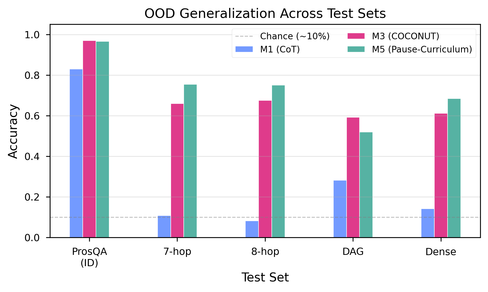
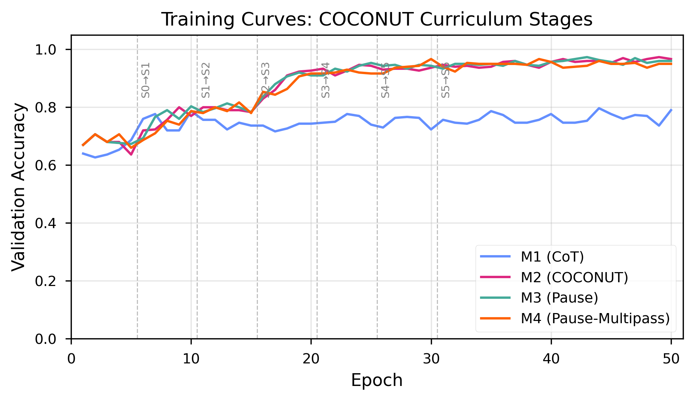
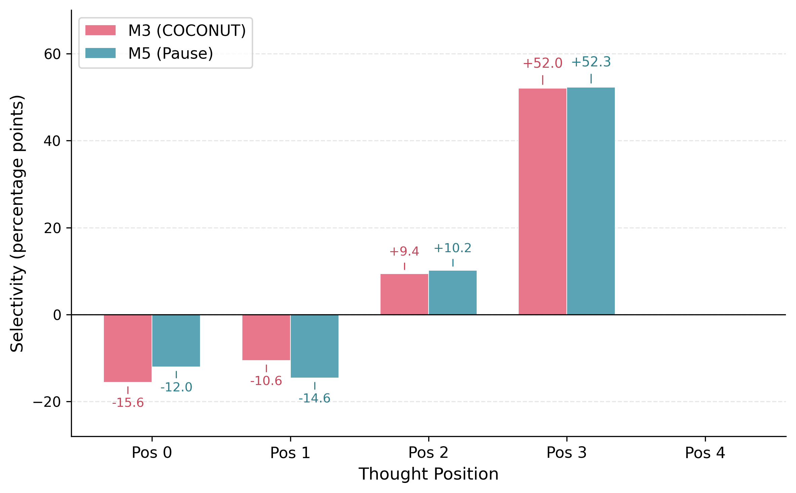
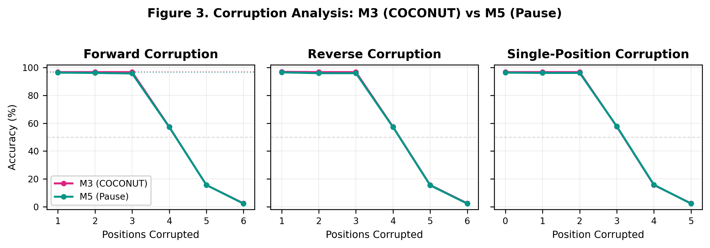

# The Curriculum Is the Mechanism: Dissecting COCONUT's Latent Thought Gains on ProsQA

**Brian Martin**
Independent Researcher

COCONUT's training curriculum has not been isolated from its recycling mechanism. We construct a factorial control design: M4 matches COCONUT's sequential multi-pass processing but uses fixed embeddings instead of recycled hidden states; M3 uses the same fixed embeddings in a single forward pass. M3 reaches 96.6% test accuracy (McNemar p = 0.845 vs. COCONUT's 97.0%); M4 reaches 94.8%. Three converging experiments — corruption analysis, linear probing, and cross-model transplantation — fail to distinguish COCONUT from M3 on any diagnostic where sequential reasoning and curriculum-driven computation make divergent predictions. The factorial decomposition reveals that recycled content impairs chain-length extrapolation (M4 outperforms COCONUT by 10.9pp on 7-hop, p < 0.001), while sequential processing drives topological generalization (M4 outperforms M3 by 7.9pp on DAG, p < 0.001). Recycled content also produces higher confidence that becomes miscalibrated on extended chains. At GPT-2 124M scale, the training curriculum — not the continuous thought mechanism — drives COCONUT's accuracy on ProsQA.

## 1 Introduction

Chain-of-thought prompting shows that large language models solve multi-step reasoning more reliably when they externalize intermediate steps (Wei et al., 2022), raising the question of whether explicit verbalization is necessary. COCONUT (Hao et al., 2024) offers the most direct test: it replaces chain-of-thought tokens with continuous thought tokens, recycling the transformer's final-layer hidden state back into the input stream across multiple positions. On ProsQA, a synthetic graph-traversal task, COCONUT achieves 97% accuracy, substantially outperforming chain-of-thought baselines (~80%). The authors attribute this gain to the expressiveness of the continuous latent space.

This attribution faces an uncontrolled confound. COCONUT is trained with a 7-stage curriculum that progressively removes explicit reasoning tokens, forcing the model to internalize computation that was previously externalized. The curriculum transforms the training distribution, the loss landscape, and the model's learned representations simultaneously with the introduction of the recycling mechanism. Any performance gain could arise from the curriculum alone, from the mechanism alone, or from their interaction. Prior work by Deng et al. (2024) has shown that progressive removal of chain-of-thought steps can teach models implicit reasoning, suggesting the curriculum may be the active ingredient. Without a control that isolates one factor from the other, the causal claim remains underdetermined.

We introduce two controls designed to resolve this confound. M3 is a single-pass pause-token baseline that shares every architectural and training detail with the COCONUT model (M2) — same GPT-2 124M backbone, same 7-stage curriculum schedule, same number of latent thought positions — but replaces recycled hidden-state embeddings with fixed learned pause vectors (Goyal et al., 2024). M4 extends M3 by matching COCONUT's sequential multi-pass processing structure while retaining the fixed pause embeddings, creating a clean factorial design: M2 vs. M4 isolates recycled content (same sequential processing, different content); M3 vs. M4 isolates sequential processing (same fixed content, different processing structure).

M3 reaches 96.6% test accuracy (McNemar p = 0.845 vs. COCONUT's 97.0%); M4 reaches 94.8%. Three converging experiments — corruption analysis, representational probing, and cross-model transplantation — fail to distinguish M2 and M3 on any diagnostic where sequential reasoning and curriculum-driven computation make divergent predictions. On out-of-distribution tests, the factorial decomposition via M4 reveals that recycled content impairs chain-length extrapolation (M4 outperforms M2 by 10.9pp on 7-hop, p < 0.001), while sequential processing drives topological generalization (M4 outperforms M3 by 7.9pp on DAG, p < 0.001). Recycled content also produces miscalibrated confidence — COCONUT is simultaneously more confident and less accurate than M4 on extended chains.

This paper makes three contributions. First, we introduce a factorial control methodology — single-pass and multi-pass pause-token baselines — that isolates the curriculum from the mechanism. Second, we provide converging evidence from three independent experimental paradigms that the continuous latent mechanism is not the causal source of COCONUT's in-distribution performance. Third, we characterize the separate contributions of recycled content and sequential processing to out-of-distribution generalization via the factorial decomposition.

## 2 Related Work

**Chain-of-thought and latent reasoning.** Wei et al. (2022) established that intermediate reasoning steps substantially improve multi-step performance, raising the question of whether verbalization is necessary. Several architectures move reasoning into latent space: Quiet-STaR (Zelikman et al., 2024) generates internal rationales at every token position, while Deng et al. (2024) showed that progressive removal of chain-of-thought steps can teach implicit reasoning — suggesting the curriculum, rather than any particular mechanism, may be the key ingredient.

**COCONUT and continuous thought.** Hao et al. (2024) proposed COCONUT, recycling the transformer's last-hidden-state output back into the embedding stream and achieving 97% on ProsQA with a multi-stage curriculum. Zhu et al. (2025) proved continuous thought tokens are strictly more expressive than discrete chain-of-thought under certain conditions. Zhang et al. (2025) challenged the empirical picture through causal interventions on LLaMA 7B and 8B, finding COCONUT's latent tokens are largely causally inert. Our work complements Zhang et al. by constructing an explicit alternative — the pause baseline — that matches COCONUT's training regime while eliminating the recycling mechanism.

**Pause tokens and extra computation.** Goyal et al. (2024) showed that appending learned non-informative pause tokens improves performance on tasks benefiting from additional depth. The pause-token framework provides a natural control for COCONUT: if gains come from extra computation rather than latent content, a pause model trained under the same curriculum should perform comparably. Our M3 instantiates this control. Pfau et al. (2024) proved that even meaningless filler tokens expand the class of solvable problems by increasing effective computation depth.

## 3 Methods

### 3.1 Task: ProsQA

ProsQA (Hao et al., 2024) is a synthetic graph-traversal benchmark where each sample presents inheritance rules over nonsense entities (e.g., "Alex is a jompus. Every jompus is a zhorpus."), followed by a binary question whose answer requires traversing the implied entity graph across 3 to 6 hops. The dataset contains 17,886 training samples, 300 validation samples, and 500 test samples. ProsQA is the task where COCONUT achieves its strongest reported results (~97%), substantially above chain-of-thought baselines (~80%), making it the strongest-case evaluation domain for the mechanism.

To illustrate: given rules mapping Alex → jompus → zhorpus → brimpus, the model must traverse a 3-hop chain to answer "Is Alex a brimpus or a daxil?" M2 processes six thought positions sequentially, each containing the recycled final-layer hidden state; M3 processes six positions containing a fixed learned embedding in a single forward pass; M4 matches M2's sequential structure with M3's fixed embedding. The key contrasts: M2 vs. M4 isolates recycled content; M3 vs. M4 isolates sequential processing.

### 3.2 Models

We train four models, all initialized from the same pretrained GPT-2 124M checkpoint (Radford et al., 2019; 124M parameters, 12 transformer layers, 768-dimensional hidden states). Table 1 summarizes the model configurations.

**Table 1:** Model configurations. All share the same pretrained initialization, optimizer, and hyperparameters. M2, M3, and M4 share the same curriculum schedule; M1 uses standard supervised training without curriculum stages.

| Model | Thought mechanism | Processing | Curriculum |
|-------|-------------------|------------|------------|
| M1 (CoT) | None — explicit text reasoning tokens | Single pass | No stages (standard supervised) |
| M2 (COCONUT) | Hidden states from previous pass recycled as input embeddings | 6 sequential passes | 7-stage progressive CoT removal |
| M3 (Pause) | Fixed learned pause embedding (`nn.Parameter`) at each thought position | Single pass | Same 7-stage curriculum as M2 |
| M4 (Pause-Multipass) | Fixed learned pause embedding (`nn.Parameter`) at each thought position | 6 sequential passes | Same 7-stage curriculum as M2 |

M3 is the primary control, isolating the continuous thought mechanism while holding all other factors constant: same initialization, optimizer (AdamW, lr = 1e-4, weight_decay = 0.01), curriculum schedule (epochs_per_stage = 5, max_latent_stage = 6), effective batch size 128, and number of attention positions. The sole difference is what occupies thought positions: M2 recycles hidden states across multiple forward passes, while M3 uses a single learned 768-dimensional embedding repeated at all six positions in a single forward pass.

However, M2 and M3 differ in two confounded ways: (1) the *content* of thought-token embeddings (recycled hidden states vs. fixed pause vectors) and (2) the *sequential processing structure* (6-pass incremental decoding vs. single-pass parallel). M4 resolves this confound by matching M2's sequential processing while using M3's fixed embeddings, creating a clean factorial decomposition:

- **M2 vs. M4:** Same sequential processing, different content → isolates recycled content
- **M3 vs. M4:** Same fixed content, different processing → isolates sequential processing
- **M2 vs. M3:** Both factors differ → confounded (for reference only)

If M4 matches M2, the sequential processing structure drives differences and recycled content is inert. If M4 matches M3, the single-pass architecture is sufficient and M2's advantages arise from recycled content. If M4 falls between, both factors contribute. Implementation details are in Appendix A.1.

### 3.3 Training

All models were trained for 50 epochs on the ProsQA training set (17,886 samples) using AdamW (lr = 1e-4, weight_decay = 0.01) with an effective batch size of 128, fp32 precision, and seed 0. For the curriculum models (M2, M3, M4), training proceeds through 7 stages: Stage 0 (epochs 0--4) trains with full chain-of-thought supervision; at each subsequent stage k, the last k reasoning steps are replaced with thought tokens. By Stage 6 (epochs 30--49), all reasoning steps are latent. Thought positions are padded to 6 regardless of path length. Additional training details (hardware, per-model wall time, optimizer protocol) are in Appendix A.2.

### 3.4 Experiments

We design three experiments. Experiment 1 (corruption ablation) progressively replaces thought-token representations with calibrated Gaussian noise. Experiment 2 (representation probing) trains linear probes on frozen hidden states across a 13×6 (layer × position) grid. Experiment 3 evaluates out-of-distribution generalization on four test sets (7-hop, 8-hop, DAG, dense; 1,000 samples each). Experiments 1 and 2 are restricted to M2 and M3 due to M4's KV-cache extraction incompatibility (Appendix A.1). Full methodological details are in Appendix A.3.

## 4 Results

### 4.1 Training Replication

Table 2 reports accuracy for all four models. M2 (COCONUT) achieves 97.0% test accuracy, replicating Hao et al. (2024). M3 (pause) reaches 96.6%, not significantly different from M2 (McNemar p = 0.845, 95% CI [--2.4, +1.6]pp, 26 discordant pairs: 14 M2-only correct, 12 M3-only correct). M4 (pause-multipass) reaches 94.8%; the 2.2pp gap from M2 does not reach significance after Bonferroni correction (p = 0.071, p_Bonf = 0.354, 31 discordant pairs). M4 and M3 likewise do not differ significantly (--1.8pp, p_Bonf = 0.680).

**Table 2:** Accuracy by model on ProsQA validation (n = 300) and test (n = 500) sets. Test accuracy is from the independent experiment inference pipeline used throughout; see Appendix A.2 for the minor discrepancy with training-time evaluation.

| Model | Mechanism | Processing | Val Accuracy | Test Accuracy | Best Epoch |
|-------|-----------|------------|:------------:|:-------------:|:----------:|
| M1 (CoT) | Explicit chain-of-thought | Single pass | 79.67% | 83.0% | 44 |
| M2 (COCONUT) | Hidden-state recycling | 6 sequential passes | 97.3% | 97.0% | 49 |
| M3 (Pause) | Learned pause embeddings | Single pass | 97.3% | 96.6% | 43 |
| M4 (Pause-Multipass) | Learned pause embeddings | 6 sequential passes | 96.7% | 94.8% | 30 |

M4's best epoch (30) occurs 13--19 epochs earlier than M2 (49) and M3 (43). Whether this reflects an inherent capacity limit of the multi-pass fixed-embedding architecture, or indicates that M4 would benefit from different hyperparameters (e.g., a lower learning rate in later curriculum stages), remains an open question. The 2.2pp gap could reflect a systematic architectural limitation, a suboptimal training configuration, or initialization variance; multi-seed replication with hyperparameter sensitivity analysis would clarify this (Section 6). Despite this earlier plateau, the 2.2pp gap between M4 (94.8%) and M2 (97.0%) does not reach significance after Bonferroni correction (p = 0.354); however, non-significance does not establish equivalence, and the gap may reflect a systematic architectural limitation that multi-seed replication could confirm (Section 6). Training curves and M4's plateau analysis are in Appendix A.2.

### 4.2 Experiment 1: Corruption Ablation

M2 and M3 exhibit nearly identical degradation profiles under progressive forward corruption (Table A1 in Appendix A.5): accuracy remains near ceiling through position 3, drops precipitously between positions 3 and 4 (from ~96% to ~57%), and collapses to near chance by position 6, with a maximum difference of 1.0pp at any corruption level. Single-position corruption confirms that position 3 alone is critical (M2: 57.6%, M3: 57.8%), ruling out redundant distributed storage (Appendix A.8). Permutation testing (5,000 trials per model) produced zero prediction flips (excludes true flip rate >0.06% at 95% confidence). Cross-problem transplantation succeeded for both models (M2: 97.0%, M3: 96.5% with hop-count-matched donors), confirming thought representations carry no problem-specific information (Appendices A.6--A.7).

### 4.3 Experiment 2: Representation Probing

Linear probes trained on frozen hidden states reveal that both models concentrate step-specific encoding at thought position 3 with near-identical selectivity profiles (Table 3; full selectivity data in Figure 3, Appendix A.4). At position 3 (n = 298), selectivity reaches +52.0pp for M2 and +52.3pp for M3 — a 0.3pp difference within cross-validation variability. Positions 0 and 1 are anti-selective in both models, indicating both broadcast answer-relevant information to early positions rather than constructing a sequential chain.

**Table 3:** Probing summary statistics for M2 and M3. Selectivity computed per-position using corrected sample sizes (see Appendix A.4). Full probe grids in Appendix A.9; nonlinear probe results in Appendix A.10.

| Metric | M2 | M3 |
|--------|:--:|:--:|
| Peak probe accuracy | 55.4% | 57.0% |
| Peak location (layer, position) | (0, 3) | (12, 3) |
| Position 3 selectivity | +52.0pp | +52.3pp |
| Positions 0--1 selectivity | --15.6pp, --10.6pp | --12.0pp, --14.6pp |
| Significant cells (Bonferroni) | 29 / 78 | 11 / 78 |

M2 shows more broadly distributed probing signal: 29/78 cells reach significance versus 11/78 for M3, with M2's signal spanning all layers at positions 2--3 while M3's is confined to late layers (9--12). M2 also shows higher thought-vs-input advantage (10.5% vs. 4.0%). However, this richer encoding does not translate to an accuracy advantage: M3 matches M2 on in-distribution accuracy and outperforms it on most OOD tests (Section 4.4). The selectivity pattern is a product of the shared training curriculum. Full heatmaps and nonlinear analysis are in Appendices A.10--A.11.

### 4.4 Experiment 3: Out-of-Distribution Generalization

Table 4 reports accuracy for all four models on four OOD test sets. M3 outperforms M2 on 7-hop (+9.4pp), 8-hop (+7.6pp), and dense (+7.2pp), while M2 outperforms M3 on DAG (--7.3pp), all significant after Bonferroni correction (pairwise details in Appendix A.12).

**Table 4:** Out-of-distribution accuracy for all models.

| Test Set | n | M1 (CoT) | M2 (COCONUT) | M3 (Pause) | M4 (Pause-Multipass) |
|----------|:---:|:---------:|:------------:|:----------:|:--------------------:|
| ProsQA (ID) | 500 | 83.0% | 97.0% | 96.6% | 94.8% |
| 7-hop | 1000 | 10.7% | 66.0% | 75.4% | 76.9% |
| 8-hop | 1000 | 8.2% | 67.5% | 75.1% | 75.2% |
| DAG | 1000 | 28.2% | 59.2% | 51.9% | 59.8% |
| Dense | 1000 | 14.1% | 61.2% | 68.4% | 64.8% |

The factorial decomposition via M4 cleanly separates the two confounded factors (Table 5). The M4 vs. M2 comparison (isolating recycled content) reveals that recycled content impairs chain-length extrapolation: M4 outperforms M2 by 10.9pp on 7-hop and 7.7pp on 8-hop (both p < 0.001 after Bonferroni correction), with no significant difference on DAG (+0.6pp, p = 1.0) or dense (+3.6pp, p = 0.280). The M4 vs. M3 comparison (isolating sequential processing) reveals that sequential processing helps topological generalization: M4 outperforms M3 by 7.9pp on DAG (p < 0.001), with no significant difference on chain-length tasks (+1.5pp and +0.1pp, both ns) or dense (--3.6pp, p = 0.306).

**Table 5:** Factorial decomposition. M4 vs. M2 isolates recycled content; M4 vs. M3 isolates sequential processing.

| Test Set | M4 -- M2 | b | c | p (Bonf.) | Sig. | M4 -- M3 | b | c | p (Bonf.) | Sig. |
|----------|:--------:|:---:|:---:|:---------:|:----:|:--------:|:---:|:---:|:---------:|:----:|
| ProsQA (ID) | --2.2 pp | 21 | 10 | 0.354 | No | --1.8 pp | 19 | 10 | 0.680 | No |
| 7-hop | +10.9 pp | 113 | 222 | < 0.001 | Yes | +1.5 pp | 124 | 139 | 1.000 | No |
| 8-hop | +7.7 pp | 111 | 188 | < 0.001 | Yes | +0.1 pp | 140 | 141 | 1.000 | No |
| DAG | +0.6 pp | 176 | 182 | 1.000 | No | +7.9 pp | 156 | 235 | < 0.001 | Yes |
| Dense | +3.6 pp | 150 | 186 | 0.280 | No | --3.6 pp | 193 | 157 | 0.306 | No |

{ width=90% }

The decomposition is approximately additive: on 7-hop, the recycled-content penalty (10.9pp) plus the neutral sequential-processing effect (1.5pp, ns) approximates the M3--M2 difference (9.4pp); on DAG, the sequential-processing advantage (7.9pp) plus the neutral recycled-content effect (0.6pp, ns) approximates the M2--M3 difference (7.3pp). On dense graphs, the recycled-content penalty (+3.6pp, ns) and the sequential-processing penalty (--3.6pp, ns) cancel additively, producing a near-zero net difference that masks opposing underlying forces rather than indicating an interaction. M1 performs near chance on all OOD sets (8--28%), confirming that curriculum-trained latent reasoning provides substantial generalization benefits over explicit chain-of-thought at this scale.

### 4.5 Teacher-Forced Confidence Analysis

Teacher-forced log-probabilities — extracted by force-decoding through the answer prefix and measuring log P(species_token) — reveal systematic confidence differences invisible to binary accuracy tests (Wilcoxon signed-rank, Bonferroni-corrected k = 5; M3 vs. M4 details in Appendix A.15).

On ProsQA, M2 assigns systematically higher confidence than M4 (r = 0.678, p < 10^{-50}), though both achieve near-ceiling median probabilities (M2: 99.998%, M4: 99.949%). The large rank-biserial correlation reflects consistent paired rank ordering, not practically meaningful absolute differences. On OOD chain-length tasks, the confidence signal becomes miscalibrated: on 7-hop, M2 is more confident than M4 (r = 0.109, p_Bonf = 0.003) yet less accurate (66.0% vs. 76.9%, +10.9pp); the same pattern appears on 8-hop (r = 0.082, p_Bonf = 0.049; accuracy 67.5% vs. 75.2%). No significant confidence difference appears on DAG (r = 0.073, p = 0.106) or dense (r = 0.118, p_Bonf = 0.001, M2 > M4). The full table is in Appendix A.14.

One possible explanation: during curriculum training on 3--6 hop problems, recycled content learns a confidence signal correlated with correctness; on out-of-distribution chains (7--8 hops), this signal persists even though the reasoning path exceeds the model's capacity. Fixed embeddings avoid this failure mode because they carry no distribution-specific content. The confounded M2 vs. M3 comparison is in Appendix A.14.

Across all four results sections, a consistent pattern emerges: every diagnostic where sequential reasoning and curriculum-driven computation make divergent predictions favors the curriculum account. Section 5.1 synthesizes this convergent evidence.

## 5 Discussion

### 5.1 Convergent Evidence

All seven diagnostics — permutation, transplant, corruption, selectivity, significance, OOD, and confidence — favor the curriculum account (full table in Appendix A.13, Table A9). The evidence does not support pure "buffering" — the strong selectivity at position 3 (+52pp) and anti-selectivity at positions 0--1 reveal structured, position-specific encoding in both models. However, this structure arises from the shared curriculum rather than the recycling mechanism.

No single experiment is decisive. Permutation insensitivity could reflect redundant encoding, but single-position corruption rules this out: corrupting position 3 alone collapses accuracy to ~57% (Appendix A.8), indicating concentrated rather than redundant storage. Taken together, seven independent diagnostics consistently fail to find evidence that COCONUT's recycled hidden states carry reasoning content that differs functionally from M3's learned pause vectors.

### 5.2 Curriculum-Driven Representations

Both M2 and M3 encode step-specific information in identical patterns: strong selectivity at position 3 (+52pp), anti-selectivity at positions 0--1, differing by only 0.3pp. M2's richer encoding — 10.5% thought-vs-input advantage, 29/78 significant cells versus 11/78 — does not produce a detectable accuracy advantage on our metrics. M3 builds its probing signal through the standard transformer computation, peaking at layer 12, yet reaches comparable or superior accuracy. This dissociation is consistent with Ravichander et al. (2021): information linearly decodable from representations is not necessarily used by downstream computation.

### 5.3 Factorial Decomposition of OOD Performance

The factorial decomposition fully resolves the M2--M3 OOD tradeoff. M2's chain-length disadvantage arises entirely from recycled content (M4 matches M3, not M2), while M2's DAG advantage arises entirely from sequential processing (M4 matches M2, not M3). The factors combine additively and affect different task types. The recycled hidden states are not merely inert — on chain-length extrapolation, models trained with recycling generalize significantly worse than matched controls, possibly because recycled content carries distribution-specific information that becomes misleading at longer path lengths.

### 5.4 Relation to Prior Work

Our results extend Zhang et al.'s (2025) finding of causal inertness from MMLU and HotpotQA to ProsQA — the task where COCONUT achieves its strongest reported performance. The convergence across tasks and scales (GPT-2 124M through LLaMA 8B) strengthens the generality, though the scale gap remains a limitation. Zhu et al.'s (2025) theoretical expressiveness is not realized in practice at this scale. Goyal et al.'s (2024) pause-token finding is confirmed and extended: curriculum-trained pause tokens match COCONUT in-distribution and exceed it on most OOD tests.

### 5.5 Practical Implications

The continuous thought mechanism introduces substantial architectural complexity: multi-pass forward loops during training and inference roughly double VRAM consumption. Our results suggest this complexity yields no measurable benefit on ProsQA at GPT-2 124M scale. For researchers building on COCONUT, curriculum design — the progressive removal of explicit reasoning tokens, the scheduling of thought-token introduction — is likely to produce larger returns than the hidden-state recycling mechanism. Simpler architectures that exploit the same curriculum achieve comparable performance at lower computational cost.

## 6 Limitations

All experiments use GPT-2 124M on synthetic ProsQA with a single training seed. The continuous thought mechanism may provide benefits at larger scale where models have capacity for the superposition states Zhu et al. (2025) proved are available, and ProsQA's unambiguous reasoning paths may understate the value of maintaining multiple candidate interpretations. Replication across 3--5 seeds would clarify whether M4's 94.8% reflects a systematic gap or initialization variance; training-time evaluation at best epoch yielded a larger apparent gap (M2 = 98.0%, M3 = 95.6%), and this sensitivity to the inference code path — arising because the training evaluator uses teacher-forced prefix tokens while the experiment pipeline uses greedy autoregressive decoding — underscores the need for multi-seed replication. All pairwise comparisons, OOD evaluations, and corruption analyses use the experiment pipeline consistently.

M4's corruption and probing coverage is limited by KV-cache incompatibility (Appendix A.1). We do not test a curriculum-only condition — one where removed reasoning tokens are simply deleted, producing shorter sequences with no thought positions. A curriculum-only ablation would distinguish whether the curriculum alone drives the gains or whether it requires additional attention positions as a computational budget; this predicts that if such a model reached ~96%, pause tokens would be unnecessary rather than merely sufficient. M2's richer encoding (29/78 significant cells vs. 11/78) does not produce a detectable accuracy advantage on our metrics, but a more sensitive measure might reveal functional consequences. Extended discussion of each limitation is in Appendix A.16.

## 7 Conclusion

We asked whether COCONUT's continuous thought tokens perform sequential latent reasoning or serve as curriculum-shaped computational scaffolding. A curriculum-matched pause baseline (M3) matches COCONUT on in-distribution ProsQA (96.6% vs. 97.0%, McNemar p = 0.845) without recycling any hidden states. A second control (M4) matches COCONUT's sequential processing with fixed embeddings, enabling factorial decomposition. Three converging experiments — corruption analysis, representational probing, and cross-model transplantation — fail to distinguish M2 and M3 on any diagnostic where the two accounts make divergent predictions.

The factorial decomposition via M4 resolves the out-of-distribution attribution: recycled content impairs chain-length extrapolation (M4 outperforms M2 by 10.9pp on 7-hop, p < 0.001), while sequential processing drives topological generalization (M4 outperforms M3 by 7.9pp on DAG, p < 0.001). Recycled content also produces miscalibrated confidence on extended chains.

At GPT-2 124M scale, the training curriculum drives COCONUT's accuracy on ProsQA. The continuous thought mechanism contributes measurably to internal representations and confidence but does not improve accuracy. For researchers developing latent reasoning architectures, curriculum design warrants at least as much attention as the choice of thought-token mechanism. Code, configurations, and experiment scripts are available at https://github.com/bmarti44/research-pipeline.

## References

Deng, Y., Yu, Y., Saha, S., Lu, J., & Hajishirzi, H. (2024). From explicit CoT to implicit CoT: Learning to internalize CoT step by step. *arXiv preprint arXiv:2405.14838*.

Goyal, S., Didolkar, A., Ke, N. R., Blundell, C., Beaulieu, P., Mozer, M., Bengio, Y., & Ke, N. R. (2024). Think before you speak: Training language models with pause tokens. In *Proceedings of the Twelfth International Conference on Learning Representations (ICLR 2024)*.

Hao, S., Gu, Y., Luo, H., Liu, T., Shao, L., Wang, X., Xie, S., Ma, T., Koltun, V., & Zettlemoyer, L. (2024). Training large language models to reason in a continuous latent space. *arXiv preprint arXiv:2412.06769*.

Meng, K., Bau, D., Andonian, A., & Belinkov, Y. (2022). Locating and editing factual associations in GPT. In *Advances in Neural Information Processing Systems 35 (NeurIPS 2022)*.

Pfau, J., Merrill, W., & Bowman, S. R. (2024). Let's think dot by dot: Hidden computation in transformer language models. In *Findings of the Association for Computational Linguistics: ACL 2024*.

Radford, A., Wu, J., Child, R., Luan, D., Amodei, D., & Sutskever, I. (2019). Language models are unsupervised multitask learners. *OpenAI Technical Report*.

Ravichander, A., Belinkov, Y., & Hovy, E. (2021). Probing the probing paradigm: Does probing accuracy entail task relevance? In *Proceedings of the 16th Conference of the European Chapter of the Association for Computational Linguistics (EACL 2021)*, pp. 3363-3377.

Saparov, A., & He, H. (2022). Language models are greedy reasoners: A systematic formal analysis of chain-of-thought. In *Proceedings of the Eleventh International Conference on Learning Representations (ICLR 2023)*.

Wei, J., Wang, X., Schuurmans, D., Bosma, M., Ichter, B., Xia, F., Chi, E., Le, Q., & Zhou, D. (2022). Chain-of-thought prompting elicits reasoning in large language models. In *Advances in Neural Information Processing Systems 35 (NeurIPS 2022)*.

Zelikman, E., Harik, G., Shao, Y., Jayasiri, V., Haber, N., & Goodman, N. D. (2024). Quiet-STaR: Language models can teach themselves to think before speaking. *arXiv preprint arXiv:2403.09629*.

Zhang, R., Du, Y., Sun, S., Guo, D., Liu, Z., Zheng, Q., & Li, L. (2025). On the causal role of continuous thought tokens. *arXiv preprint arXiv:2512.21711*.

Zhu, Z., Wang, T., & Dong, Y. (2025). On the expressiveness of continuous thought. In *Proceedings of the 42nd International Conference on Machine Learning (ICML 2025)*.

---

## Appendix

### A.1 Detailed Model Implementation

M3 was implemented by adding a `feedback_mode` parameter to the `Coconut` class in Meta's official codebase. When `feedback_mode="continuous"` (default), the model operates as standard COCONUT (M2). When `feedback_mode="pause_curriculum"`, thought positions receive a learned `nn.Parameter` embedding and inference executes a single forward pass (M3). When `feedback_mode="pause_multipass"`, thought positions receive the same learned embedding but are processed sequentially across 6 passes, matching M2's KV-cache incremental decoding structure (M4). The modification is minimal: a single branching parameter in the model class, with all other code (data loading, training loop, evaluation) shared across all models.

**FLOP comparison.** M3 requires substantially fewer inference-time FLOPs than M2. COCONUT's recycling loop processes thought tokens sequentially: after a full forward pass over the input prefix, each subsequent thought token is processed as a single-token forward pass using KV-cache incremental decoding, with the previous position's final-layer hidden state injected as the current position's input embedding. M3 instead processes all thought tokens in a single forward pass alongside the input. M4 matches M2's sequential processing structure exactly — processing thought tokens one at a time via KV-cache incremental decoding across 6 passes — but re-injects the same fixed pause embedding at each step rather than recycling content. M2 and M4 are matched on sequential processing structure and total FLOPs, differing only in what is injected at each step. M3 and M4 differ only in whether thought tokens are processed sequentially or in parallel.

The only position-distinguishing signal available to M3 is GPT-2's learned positional encoding; the pause embeddings carry no position-specific information. A key difference is that M2's sequential KV-cache decoding restricts each thought position to attending only to preceding positions (causal mask over passes), whereas M3's single-pass processing allows all thought positions to attend to each other simultaneously. M4 processes the same fixed embedding at each of its 6 sequential passes.

**M4 KV-cache incompatibility.** The corruption analysis and probing experiments extract hidden states by running a fresh forward pass on the model's input embeddings, discarding the accumulated KV-cache state. For M2, whose continuous thought tokens are computed from recycled hidden states, this extraction correctly captures the model's inference-time representations. For M4, the KV-cache accumulated across the 6 sequential passes IS the model's computation — without it, extracted representations reflect only the fixed pause embedding processed in isolation, not the representation built through sequential accumulation. Corruption injection and probing on these artifacts would measure properties of the extraction pipeline, not of the model. The zero-corruption control confirms this: M4 produces chance-level accuracy (2.4%) under the extraction methodology even with no corruption applied.

### A.2 Training Details and Curves

**Hardware.** All training was conducted on a single NVIDIA H100 80GB GPU. M1 required approximately 8 hours; M2, M3, and M4 each required approximately 28--40 hours due to the multi-pass forward loop (M2, M4) and the longer sequences with thought tokens (all curriculum models). M4 is the slowest due to processing 6 sequential passes with fixed embeddings, which prevents the KV-cache optimization that COCONUT's recycled states enable.

**Optimizer reset.** The optimizer was reset at the start of each epoch, following Meta's training protocol (`reset_optimizer: True`). Training used the same matching configuration as Meta: batch size 32 with gradient accumulation over 4 steps on a single GPU, matching Meta's original 4-GPU configuration of batch size 32 with no gradient accumulation.

**Inference pipeline discrepancy.** Training-time evaluation at best epoch yielded M2 = 98.0% and M3 = 95.6%, differing from the experiment pipeline by 5 samples per model in opposite directions. The discrepancy arises because the training-time evaluator (Meta's `run.py`) and our experiment pipeline (`exp_ood.py`) differ in tokenization handling of the answer prefix: the training evaluator conditions on teacher-forced prefix tokens, while the experiment pipeline uses greedy autoregressive decoding from the last thought token. We use the experiment-pipeline numbers throughout because all pairwise comparisons, corruption analyses, and OOD evaluations were conducted with the same pipeline, ensuring internal consistency.

**Training curves.** Figure 2 shows training curves for all four models across 50 epochs. M2, M3, and M4 converge at comparable rates under the shared curriculum schedule, while M1 plateaus earlier at a lower asymptote.

{ width=90% }

**M4 plateau analysis.** M4's best epoch (30) occurs 13--19 epochs earlier than the other curriculum models (M2: 49, M3: 43, M1: 44). Inspection of M4's full validation trajectory reveals that this early peak reflects noise in a high-variance plateau rather than overfitting: after epoch 30, validation accuracy fluctuates between 93.7% and 96.7% (matching the peak) for the remaining 20 epochs, with a second 96.7% hit at epoch 39. The "best epoch 30" selection captures a fluctuation peak in this plateau; the model's late-training performance (epochs 30--49, mean ~95.0%) is stable but does not improve further. Two interpretations of this plateau are possible. First, M4's multi-pass fixed-embedding architecture may converge to its representational capacity limit earlier than M2's recycling architecture, which continues refining representations through epoch 49. Alternatively, our curriculum schedule — optimized for M2 — may be suboptimal for M4, leaving open the possibility that a longer or differently structured curriculum could unlock further gains. The present data cannot distinguish these accounts; dedicated M4 curriculum ablations would be needed to adjudicate.

### A.3 Detailed Experiment Methodology

**Experiment 1: Corruption Ablation — full predictions and conditions.** If thought tokens encode a sequential reasoning chain, three predictions follow: (a) corrupting early positions should cascade through the chain, producing gradual degradation proportional to the number of positions corrupted; (b) permuting the order of thought tokens should disrupt the sequential dependency, changing the model's predictions; and (c) transplanting thought representations from one problem into another should fail, since a sequential chain encodes problem-specific intermediate states. If thought tokens instead serve as a generic compute buffer, the alternative predictions are: (a) degradation should be threshold-based — the model either has enough uncorrupted buffer positions to function or it does not; (b) permutation should have no effect, since buffer positions carry order-invariant information; and (c) transplantation should succeed, since the buffer carries no problem-specific content.

We apply six corruption conditions:

- *Forward corruption:* progressively replace thought positions 0, 0:1, 0:2, ..., 0:5 with random embeddings drawn from a distribution matched to the model's actual thought token statistics.
- *Reverse corruption:* the same procedure applied from the final position backward.
- *Single-position corruption:* replace only position k for each k in {0, ..., 5}.
- *Permutation:* shuffle the order of the model's own thought token hidden states for the same problem (10 random permutations per sample, 500 samples).
- *Partial permutation:* swap only adjacent pairs of thought tokens, testing sensitivity to local versus global ordering.
- *Cross-problem transplant:* inject thought representations from problem A into problem B (200 pairs, matched by hop count).

All random replacement embeddings were drawn to match the mean and standard deviation of each model's actual thought token hidden states. For M2, this yielded an L2 distance of 202.65 from the originals. For M3, the L2 distance was 4.09. This 50-fold difference reflects the fundamental architectural distinction: recycled hidden states carry rich, variable information across problems, while pause embeddings are approximately constant. The per-model calibration ensures that each model's corruption is scaled appropriately to its own activation magnitude, though the absolute perturbation sizes are not directly comparable between models.

**Experiment 2: Representation Probing — full methodology.** We extract hidden states at every (layer, thought position) cell in a 13 × 6 grid (13 layers including the input embedding layer, 6 thought positions) and train linear probes (RidgeClassifier with default regularization) to classify the identity of the entity at the corresponding step in the ground-truth reasoning path. All probes use 5-fold cross-validation over 500 samples. The number of valid probe targets varies by position: all 500 samples contribute labels for positions 0--2, 298 for position 3, 81 for position 4, and 12 for position 5, reflecting the distribution of path lengths in the test set. Results for position 5 (n = 12) should be interpreted with caution.

Three diagnostic metrics are computed. *Selectivity:* selectivity(l, t) = probe_acc(target = step_t) - max_{s != t} probe_acc(target = step_s). *Thought-minus-input advantage:* accuracy difference between probes on thought positions and input token positions. *Nonlinear probes:* 2-layer MLP probes with grid search over 72 hyperparameter configurations (6 hidden sizes × 3 learning rates × 4 regularization strengths; see Appendix A.10).

**Experiment 3: OOD — statistical methodology.** For statistical comparisons, we use exact McNemar's test (two-sided binomial test on the disagreement counts) on each of the five test sets, applied to three pairwise comparisons: M2 vs. M3, M2 vs. M4, and M3 vs. M4. Bonferroni correction is applied within each comparison family. McNemar's test uses only the discordant pairs (samples where exactly one model is correct) and is more powerful than marginal tests when agreement rates are high.

### A.4 Selectivity Computation Correction and Corrected Permutation Tests

The original selectivity analysis truncated all positions to n = 12 samples (limited by position 5), producing an artifactual selectivity of 0.0 across all cells. The corrected analysis uses each position's full sample count (500 for positions 0--2, 298 for position 3, 81 for position 4). Position 5 (n = 12) is excluded from quantitative claims. The corrected selectivity values are reported in Table 3 and Figure 3.

The same truncation invalidated the permutation-based significance tests computed during the original probing run: with only 12 samples across 38+ classes, probes returned near-zero accuracy regardless of label permutation, yielding uniformly non-significant p-values (p = 1.0 for all 78 cells).

We reran permutation tests with corrected sample sizes using 2,000 permutations per cell (minimum achievable p = 1/2001 = 0.0005, below the Bonferroni threshold of 0.05/78 = 0.000641). The permutation test uses an optimized ridge classifier with precomputed Cholesky decomposition on a single 80/20 stratified split, counting exceedances with the conservative estimator p = (count + 1) / (n_perms + 1).

**M2 (COCONUT): 29/78 significant cells.** All 13 layers are significant at positions 2 and 3 (26 cells), plus layer 8 and 9 at position 0, and layer 11 at position 1. The peak accuracy of 55.4% at (layer 0, position 3) achieves p = 0.0005. Every layer at position 3 exceeds 25% accuracy (38-class chance = 2.6%), and every layer at position 2 exceeds 11.8%.

**M3 (Pause): 11/78 significant cells.** Significant cells are concentrated in late layers: layers 7--10 and 12 at position 0, layers 9 and 11 at position 1, layers 11--12 at position 2, and layers 11--12 at position 3. The peak accuracy of 57.0% at (layer 12, position 3) achieves p = 0.0005.

The key difference is in the distribution of significant cells. M2 shows significant probing accuracy across all layers at positions 2--3, consistent with the recycling mechanism injecting decodable information from the earliest layer. M3 shows significance only in late layers (primarily 9--12), consistent with representations being built through the transformer stack. This architectural difference in where information is available does not produce a behavioral difference: both models achieve comparable task accuracy and selectivity profiles.

Positions 4 and 5 return 0.0% accuracy for both models (n = 81 with 32 classes and n = 12 with 12 classes, respectively); with more classes than the minimum fold size, stratified cross-validation cannot be computed, and these cells are excluded from significance testing.

{ width=90% }

### A.5 Cross-Corruption Results

**Table A1:** Progressive forward corruption under three noise conditions (n = 500 per condition).

| Positions Corrupted | M2 + M2-noise (L2~203) | M3 + M3-noise (L2~4) | M3 + M2-noise (L2~203) |
|:-------------------:|:-----------------------:|:---------------------:|:-----------------------:|
| 0 (clean) | 97.0% | 96.6% | 96.6% |
| 1 | 96.8% | 96.4% | 96.6% |
| 2 | 96.8% | 96.2% | 96.4% |
| 3 | 96.8% | 95.8% | 96.4% |
| 4 | 57.4% | 57.2% | 57.6% |
| 5 | 15.6% | 15.6% | 15.8% |
| 6 | 2.4% | 2.2% | 2.4% |

### A.6 Permutation Sensitivity and Power Analysis

**Permutation sensitivity.** We tested whether the ordering of thought tokens carries sequential information by permuting all latent positions and measuring the rate at which the model's prediction changes. Across 500 test samples with 10 random permutations each (5,000 permutation trials per model), neither M2 nor M3 produced a single prediction flip (flip rate = 0.0%). Partial permutation experiments, in which subsets of positions were permuted, likewise produced a 0.0% flip rate. Both models treat thought positions as an unordered bag of compute with respect to final predictions. This does not rule out order-sensitive internal representations that are ultimately redundant for the final prediction. This result creates a tension with the corruption findings: if individual positions carry no ordering information, yet corrupting position 3 alone collapses accuracy (Appendix A.8), the model must perform content-based routing — attending to what each position contains rather than where it falls in the sequence. The combination of order-invariance and position-specific criticality is consistent with an attention mechanism that selects the most informative position regardless of its index.

**Power analysis.** With 5,000 permutation trials and zero observed flips, the exact binomial test excludes a true flip rate above 0.06% at 95% confidence (0.09% at 99% confidence).

### A.7 Cross-Problem Transplantation

To test whether thought representations encode problem-specific information, we transplanted the full set of thought-token activations from one problem into another and measured accuracy on the recipient problem.

**Table A2:** Cross-problem transplantation accuracy under matched and unmatched conditions (200 pairs each).

| Condition | M2 | M3 |
|-----------|:--:|:--:|
| Clean (no transplant) | 97.0% | 96.6% |
| Matched transplant (hop-count aligned) | 97.0% | 96.5% |
| Unmatched transplant (random pairing) | 97.5% | 96.5% |

Fully unmatched transplantation (random donor-recipient pairing with no hop-count matching) produced comparable results, confirming that thought representations carry no problem-specific or complexity-specific information.

### A.8 Full Corruption Results — Reverse and Single-Position

**Table A3:** Reverse corruption accuracy (n = 500; corrupting from position 5 backward).

| Positions Corrupted | M2 | M3 |
|:-------------------:|:--:|:--:|
| 1 (pos 5) | 97.0% | 96.6% |
| 2 (pos 4--5) | 96.8% | 96.0% |
| 3 (pos 3--5) | 96.8% | 96.0% |
| 4 (pos 2--5) | 57.4% | 57.2% |
| 5 (pos 1--5) | 15.6% | 15.4% |
| 6 (pos 0--5) | 2.4% | 2.2% |

**Table A4:** Single-position corruption accuracy (n = 500; corrupting only position k).

| Position Corrupted | M2 | M3 |
|:------------------:|:--:|:--:|
| 0 | 96.8% | 96.4% |
| 1 | 96.8% | 96.2% |
| 2 | 96.8% | 96.2% |
| 3 | 57.6% | 57.8% |
| 4 | 15.6% | 15.8% |
| 5 | 2.4% | 2.2% |

Reverse and single-position corruption confirm the forward corruption findings. The cliff occurs at the same position regardless of corruption direction. Single-position corruption at position 3 alone causes the same catastrophic drop as corrupting positions 0--3 together, indicating that position 3 carries critical information while positions 0--2 carry mutually redundant copies of answer-relevant content.

{ width=90% }

### A.9 Full Linear Probe Accuracy Grids

**Table A5:** M2 (COCONUT) linear probe accuracy (%, 5-fold CV). Rows = transformer layers (0 = embedding layer, 12 = final layer). Columns = thought positions (0--5). Positions 4--5 show 0.0% due to insufficient samples (n = 81 and n = 12).

| Layer | Pos 0 | Pos 1 | Pos 2 | Pos 3 | Pos 4 | Pos 5 |
|:-----:|:-----:|:-----:|:-----:|:-----:|:-----:|:-----:|
| 0 | 8.6 | 8.6 | 18.6 | 55.4 | 0.0 | 0.0 |
| 1 | 8.8 | 8.8 | 16.0 | 54.7 | 0.0 | 0.0 |
| 2 | 8.8 | 8.0 | 18.4 | 49.0 | 0.0 | 0.0 |
| 3 | 8.0 | 7.2 | 14.6 | 46.6 | 0.0 | 0.0 |
| 4 | 9.0 | 6.0 | 14.4 | 46.0 | 0.0 | 0.0 |
| 5 | 7.6 | 7.4 | 14.0 | 43.0 | 0.0 | 0.0 |
| 6 | 9.8 | 5.8 | 13.8 | 39.6 | 0.0 | 0.0 |
| 7 | 7.2 | 6.4 | 12.2 | 37.9 | 0.0 | 0.0 |
| 8 | 13.0 | 6.6 | 13.0 | 25.8 | 0.0 | 0.0 |
| 9 | 9.0 | 7.6 | 11.8 | 27.9 | 0.0 | 0.0 |
| 10 | 5.8 | 9.4 | 14.0 | 32.9 | 0.0 | 0.0 |
| 11 | 7.6 | 9.4 | 17.4 | 52.7 | 0.0 | 0.0 |
| 12 | 5.4 | 10.0 | 19.0 | 55.0 | 0.0 | 0.0 |

**Table A6:** M3 (Pause) linear probe accuracy (%, 5-fold CV).

| Layer | Pos 0 | Pos 1 | Pos 2 | Pos 3 | Pos 4 | Pos 5 |
|:-----:|:-----:|:-----:|:-----:|:-----:|:-----:|:-----:|
| 0 | 3.2 | 3.2 | 4.4 | 4.4 | 0.0 | 0.0 |
| 1 | 3.6 | 1.8 | 5.0 | 6.4 | 0.0 | 0.0 |
| 2 | 5.8 | 3.0 | 4.4 | 5.0 | 0.0 | 0.0 |
| 3 | 5.0 | 3.0 | 4.2 | 7.4 | 0.0 | 0.0 |
| 4 | 5.2 | 3.6 | 4.4 | 8.4 | 0.0 | 0.0 |
| 5 | 6.8 | 3.0 | 5.8 | 11.4 | 0.0 | 0.0 |
| 6 | 7.4 | 5.8 | 4.6 | 8.4 | 0.0 | 0.0 |
| 7 | 10.4 | 4.0 | 3.4 | 4.7 | 0.0 | 0.0 |
| 8 | 23.6 | 5.4 | 3.8 | 2.7 | 0.0 | 0.0 |
| 9 | 14.6 | 9.2 | 6.8 | 3.0 | 0.0 | 0.0 |
| 10 | 11.0 | 9.0 | 6.6 | 4.7 | 0.0 | 0.0 |
| 11 | 10.0 | 10.4 | 21.6 | 53.0 | 0.0 | 0.0 |
| 12 | 10.2 | 7.8 | 22.0 | 57.0 | 0.0 | 0.0 |

### A.10 Nonlinear Probe Results

Our initial MLP probes (2-layer, 256 hidden units, scikit-learn MLPClassifier with default hyperparameters) produced a uniform 0/78 null result. As anticipated, this reflected convergence failure rather than a genuine absence of nonlinear encoding.

**Grid search methodology.** We conducted a systematic hyperparameter search over the five cells with highest linear probe accuracy: M2 (layer 0, position 3), M2 (layer 12, position 2), M3 (layer 12, position 3), M3 (layer 8, position 0), and M3 (layer 12, position 2). For each cell, we evaluated 72 configurations: 6 hidden layer sizes (64, 96, 128, 192, 256, 512) × 3 learning rates (0.0001, 0.001, 0.01) × 4 L2 regularization strengths (0.0001, 0.001, 0.01, 0.1), using 5-fold cross-validation and max_iter=2000.

**Table A7:** MLP probe grid search results at five target cells (advantage = best MLP accuracy − linear probe accuracy).

| Model | Layer | Pos | N | Linear | Best MLP | Advantage |
|-------|:-----:|:---:|:---:|:------:|:--------:|:---------:|
| M2 | 0 | 3 | 298 | 55.4% | 46.0% | --9.4pp |
| M2 | 12 | 2 | 500 | 19.0% | 29.2% | **+10.2pp** |
| M3 | 12 | 3 | 298 | 57.0% | 45.6% | --11.4pp |
| M3 | 8 | 0 | 500 | 23.6% | 14.6% | --9.0pp |
| M3 | 12 | 2 | 500 | 22.0% | 29.6% | **+7.6pp** |

At **position 3** (the answer hop), linear probes outperform MLPs by approximately 10 percentage points. Two non-exclusive factors likely contribute: (1) with n = 298 samples and 38 target classes (~7.8 samples per class), the MLP's larger parameter count overfits despite regularization; and (2) since the answer-generation head is itself a linear projection, training may explicitly produce a linearly separable representation at this position — a format that linear probes recover by design but that additional nonlinear capacity cannot exploit further.

At **position 2** (the intermediate hop), MLPs show a substantial advantage: +10.2 percentage points for M2 and +7.6 for M3. With n = 500, overfitting is less severe, and the MLP captures nonlinear structure that linear probes miss. This suggests that intermediate reasoning steps are encoded in a more complex, nonlinearly distributed format, while the final answer is projected into a linearly decodable subspace.

Both models show the same qualitative pattern (linear-sufficient at position 3, nonlinear advantage at position 2), consistent with the shared curriculum producing similar representational strategies.

### A.11 Full Probing Heatmaps and Additional Analysis

**Probing heatmaps.** Figure 5 shows the full linear probe accuracy heatmaps across all layers and thought positions for both models.

{ width=90% }

The two models concentrate decodable information at different locations in the network. M2's peak probe accuracy occurs at layer 0, position 3. Because COCONUT recycles the final-layer hidden state back into the input embedding stream, the recycled representation arrives pre-processed at layer 0, making intermediate information linearly accessible from the earliest layer. M3 builds its representations through the transformer stack, with peak accuracy at layer 12 (the final layer). The diagonal peak layers for M2 are [8, 12, 12, 0] across positions 0--3; for M3 they are [8, 11, 12, 12]. These patterns reflect architectural differences in where information is injected, not differences in what information is encoded.

**Thought-vs-input advantage.** M2's thought-token positions encode 10.5% more decodable information than its input positions, compared with 4.0% for M3. The recycling mechanism creates broadly distributed, robustly decodable intermediate representations, consistent with its architectural design. But this richer encoding does not produce a different selectivity pattern or an accuracy advantage.

**Layer-dependent selectivity for M3.** Table 3 reports selectivity at layer 12 for all M3 positions. At alternative layers, selectivity values differ: position 0 shows +17.0pp (positive, not anti-selective) at layer 8, while position 1 shows --11.2pp at layer 11. The anti-selectivity pattern at early positions is thus layer-dependent for M3.

### A.12 M2 vs. M3 Pairwise OOD Comparisons

This table is retained from the two-model analysis for completeness. The M2 vs. M3 comparison is confounded by the forward-pass asymmetry; the factorial decomposition (Table 5) provides the clean attribution.

**Table A8:** Pairwise McNemar comparisons (M3 vs. M2).

| Test Set | M3 -- M2 | b | c | p (exact) | p (Bonf.) | Sig. |
|----------|:--------:|:---:|:---:|:---------:|:---------:|:----:|
| ProsQA (ID) | --0.4 pp | 14 | 12 | 0.845 | 1.000 | No |
| 7-hop | +9.4 pp | 120 | 214 | < 0.001 | < 0.001 | Yes |
| 8-hop | +7.6 pp | 122 | 198 | < 0.001 | < 0.001 | Yes |
| DAG | --7.3 pp | 235 | 162 | < 0.001 | 0.0015 | Yes |
| Dense | +7.2 pp | 139 | 211 | < 0.001 | < 0.001 | Yes |

### A.13 Full Convergent Evidence Table

Section 5.1 in the main text provides a compact summary. Table A9 below gives the full analysis with detailed discussion of each diagnostic.

**Table A9:** Full convergent evidence across experimental paradigms with detailed results.

| Evidence | Sequential reasoning prediction | Curriculum-driven prediction | Our result |
|----------|:-:|:-:|:-:|
| Permutation sensitivity | Order matters | Order irrelevant (for output) | 0% flip rate for both M2 and M3 |
| Cross-transplant | Problem-specific states | Generic / curriculum-shaped | Both tolerate foreign thoughts (M2: 97.0%, M3: 96.5%); unmatched pairing equally effective |
| Corruption cliff | Gradual cascade | Threshold collapse | Identical cliff at position 4 for both models; persists under 50× noise scaling |
| Probing selectivity | M2-specific step encoding | Shared curriculum-driven pattern | Both models show identical selectivity profiles: strong step-specificity at position 3 (+52pp), anti-selectivity at positions 0--1, arising from shared curriculum |
| Probing significance | M2 broadly significant | Equal significance | M2: 29/78 significant cells; M3: 11/78. COCONUT encodes more broadly but without behavioral gain |
| Thought-vs-input advantage | Only COCONUT benefits | Equal benefit | M2 higher (10.5% vs. 4.0%), but does not produce different strategy |
| OOD generalization | COCONUT advantages | Equal or M3 advantages | M3 wins 3/4; M2 wins DAG (all significant). Factorial decomposition: training with recycled content impairs chain-length extrapolation; sequential processing drives DAG advantage |
| Teacher-forced confidence | M2 uniformly more confident | Equal confidence | M2 more confident on ID (r = 0.678) but overconfident on OOD: higher confidence with lower accuracy on 7-hop and 8-hop |

**Detailed discussion.** No single experiment is decisive in isolation. Permutation insensitivity could in principle reflect redundant encoding, where each position stores a complete copy of the reasoning chain. However, single-position corruption rules this out: if all positions stored the complete chain redundantly, corrupting any single position should be compensated by the remaining uncorrupted copies. Instead, corrupting position 3 alone collapses accuracy to ~57% (Table A4), indicating that critical information is concentrated at position 3 rather than redundantly distributed. Cross-transplant tolerance could indicate overlapping representations. But taken together, seven independent diagnostics consistently fail to find evidence that COCONUT's recycled hidden states carry reasoning content that differs functionally from M3's learned pause vectors on in-distribution evaluation. The convergence across methods strengthens the conclusion beyond what any single test provides.

The OOD results add nuance: M2 and M3 show a task-dependent generalization tradeoff, which M4's factorial decomposition fully resolves — attributing M2's chain-length disadvantage to recycled content and M2's DAG advantage to sequential processing. The teacher-forced confidence analysis adds a further dimension: M2's recycled content produces significantly higher per-sample confidence on in-distribution data, confirming that the recycled hidden states carry reasoning-relevant information. However, this higher confidence becomes miscalibrated on OOD chain-length tasks, where M2 is simultaneously more confident and less accurate than M4.

### A.14 Wilcoxon Confidence Tables

**Table 6a:** Clean comparison — recycled content (M2 vs. M4). Wilcoxon signed-rank on teacher-forced species-token log-probabilities. r = rank-biserial correlation. Bonferroni-corrected (k = 5). Both models share sequential processing; the comparison isolates the effect of recycled content.

| Test Set | n | r | p (Bonf.) | Direction | Sig. |
|----------|:---:|:---:|:---------:|:---------:|:----:|
| ProsQA (ID) | 500 | 0.678 | < 10^{-50} | M2 > M4 | Yes |
| 7-hop | 1000 | 0.109 | 0.003 | M2 > M4 | Yes |
| 8-hop | 1000 | 0.082 | 0.049 | M2 > M4 | Yes |
| DAG | 1000 | 0.073 | 0.106 | — | No |
| Dense | 1000 | 0.118 | 0.001 | M2 > M4 | Yes |

**Table 6b:** Confounded comparison — forward-pass asymmetry (M2 vs. M3). M2 processes sequentially, M3 in parallel; interpret through the factorial decomposition.

| Test Set | n | r | p (Bonf.) | Direction | Sig. |
|----------|:---:|:---:|:---------:|:---------:|:----:|
| ProsQA (ID) | 500 | 0.591 | < 10^{-38} | M2 > M3 | Yes |
| 7-hop | 1000 | 0.006 | 1.000 | — | No |
| 8-hop | 1000 | 0.006 | 1.000 | — | No |
| DAG | 1000 | 0.003 | 1.000 | — | No |
| Dense | 1000 | 0.113 | 0.002 | M3 > M2 | Yes |

**Confounded comparison (M2 vs. M3).** The M2 vs. M3 comparison is confounded by the forward-pass asymmetry (Section 6) and is retained for completeness. M2 shows higher in-distribution confidence (r = 0.591, p < 10^{-38}) but no significant confidence difference on 7-hop or 8-hop (r < 0.01, p = 1.0), consistent with the chain-length tasks neutralizing the recycled-content signal.

### A.15 M3 vs. M4 Confidence Details

The M3 vs. M4 comparison reveals that sequential processing (controlling for content) increases OOD confidence.

**Table A10:** Wilcoxon signed-rank comparisons: M3 vs. M4. Bonferroni-corrected (k = 5).

| Comparison | Test Set | n | r | p (Bonf.) | Direction | Sig. |
|------------|----------|:---:|:---:|:---------:|:---------:|:----:|
| M3 vs. M4 | ProsQA (ID) | 500 | 0.286 | < 10^{-9} | M3 > M4 | Yes |
| M3 vs. M4 | 7-hop | 1000 | 0.142 | < 0.001 | M4 > M3 | Yes |
| M3 vs. M4 | 8-hop | 1000 | 0.120 | 0.001 | M4 > M3 | Yes |
| M3 vs. M4 | DAG | 1000 | 0.136 | < 0.001 | M4 > M3 | Yes |
| M3 vs. M4 | Dense | 1000 | 0.021 | 1.000 | — | No |

On ProsQA (in-distribution), M3 assigns higher median probabilities than M4 (r = 0.286, p < 10^{-9}), consistent with the single-pass architecture maintaining higher in-distribution confidence. On OOD test sets, M4 assigns higher median probabilities than M3 on 7-hop (r = 0.142), 8-hop (r = 0.120), and DAG (r = 0.136), all significant. On DAG, this higher confidence aligns with M4's higher accuracy (+7.9pp). On 7-hop and 8-hop, M4's slightly higher accuracy (+1.5pp and +0.1pp, both ns by McNemar) is accompanied by significantly higher confidence, suggesting that sequential processing produces better-calibrated representations on OOD tasks — a benefit that is modest in accuracy terms but substantial in confidence terms.

### A.16 Detailed Limitation Analysis

**Scale.** All experiments use GPT-2 124M, a model with 12 layers and 768-dimensional hidden states. Zhang et al. (2025) conducted their causal intervention study on LLaMA 7B and 8B, which are 56--64 times larger. It is possible that the continuous thought mechanism provides benefits that emerge only at larger scale, where the model has sufficient capacity to learn the superposition states that Zhu et al. (2025) proved are theoretically available. Our negative results establish that the mechanism is not necessary for ProsQA performance at 124M parameters, but they do not rule out scale-dependent effects. Replication at LLaMA-class scale would substantially strengthen or weaken our claims.

**Task complexity.** ProsQA is a synthetic graph-traversal benchmark with perfectly structured, unambiguous reasoning paths. Each problem has a unique correct answer, the graph topology is fully specified, and there is no lexical or semantic ambiguity. Natural language reasoning involves noise, underspecification, conflicting evidence, and graded plausibility. The recycling mechanism's ability to encode superposition states (Zhu et al., 2025) may be more valuable in settings where the model must maintain multiple candidate interpretations simultaneously — a capacity that ProsQA's deterministic structure does not require. Our conclusions are specific to tasks with this structural profile.

**Single seed.** All results are from a single training seed (seed 0). The 0.4-percentage-point test-set gap between M2 (97.0%) and M3 (96.6%) is not statistically significant (McNemar p = 0.845), but could widen or reverse under different random initializations. The out-of-distribution advantages we report for M3 — including the 9.4-point gap on 7-hop paths — may similarly reflect seed-specific training dynamics rather than systematic architectural differences. Replication across 3--5 training seeds with paired statistical tests would provide confidence intervals around these estimates and clarify whether M4's 94.8% reflects a systematic gap or initialization variance; in particular, whether the robustness of ID equivalence versus the variability of OOD effects is itself seed-dependent remains untested. Training-time evaluation at best epoch yielded a larger apparent gap (M2 = 98.0%, M3 = 95.6%), differing from the experiment-pipeline numbers by 5 samples per model in opposite directions; this sensitivity to the inference code path underscores the need for multi-seed replication.

**Forward-pass asymmetry (addressed by M4).** M2 processes thought tokens sequentially via KV-cache incremental decoding, while M3 processes all thought tokens in a single forward pass. In the two-model comparison, this meant M2 and M3 differed in two confounded ways: (1) the content of thought-token embeddings and (2) the sequential processing structure. M4 resolves this confound by matching M2's sequential processing while using M3's fixed embeddings. While M4 resolves the content-vs-processing confound, a residual asymmetry remains: M4 and M2 process the same number of sequential steps, but the information available at each step differs qualitatively (fixed embedding vs. a representation that reflects accumulated state). This is an inherent property of the recycling mechanism and cannot be further decomposed without more invasive interventions.

**Curriculum isolation.** Our design controls for the continuous thought mechanism by replacing it with pause tokens while preserving the curriculum. However, we do not test a curriculum-only condition in which removed reasoning tokens are simply deleted, producing shorter sequences with no additional attention positions. We therefore cannot distinguish whether the curriculum alone drives the gains or whether the curriculum requires additional attention positions as a computational budget. A curriculum-only ablation would resolve this ambiguity.

**Probing measures presence, not use.** M2's 10.5% mean thought-position advantage over input positions, and its nearly 3× greater number of significant probing cells (29/78 vs. 11/78), demonstrate that the recycling mechanism has a measurable and substantial effect on the model's internal representations. The mechanism is not "doing nothing" — it injects broadly distributed, decodable information that the pause baseline does not contain. Our claim is narrower: this richer encoding does not produce a different representational strategy or an accuracy advantage. But the distinction between presence and use is subtle; a more sensitive behavioral measure might reveal functional consequences. Additionally, probing results for thought positions 4 and 5 (n = 81 and n = 12, respectively) have limited statistical power; our quantitative claims rest primarily on positions 0--3.

**Corruption noise calibration.** The per-model noise calibration produces substantially different absolute perturbation magnitudes (L2 = 202.65 for M2 vs. 4.09 for M3), reflecting the 50-fold variance difference between recycled hidden states and near-constant pause embeddings. Our cross-scale analysis (applying M2-magnitude noise to M3) confirms that the degradation cliff is structural rather than scale-dependent, but the quantitative degradation curves under per-model calibration are not directly comparable across models.

**M4 experimental coverage.** The corruption analysis and representational probing experiments could not be extended to M4 due to a methodological incompatibility with multi-pass KV-cache architectures (see Appendix A.1). Extending these experiments to M4 would require per-pass hidden state collection from within the KV-cache loop, which we leave for future work.

### A.17 OOD Dataset Statistics

All OOD test sets contain 1,000 samples generated using ProsQA's vocabulary (38 species names, 17 person names) with seed 42.

**Table A11:** OOD dataset generation parameters.

| Test Set | n | Path Length | Graph Type | Branching Factor |
|----------|:---:|:-----------:|:----------:|:----------------:|
| ProsQA (ID) | 500 | 3--6 | Tree | 2--4 |
| 7-hop | 1000 | 7 | Tree | 2--4 |
| 8-hop | 1000 | 8 | Tree | 2--4 |
| DAG | 1000 | 3--6 | DAG | 2--4 |
| Dense | 1000 | 3--6 | Tree | 5--8 |

### A.18 Datasets

#### Examples

We provide an example of the questions and chain-of-thought solutions for ProsQA.

**Question:** "Every shumpus is a rempus. Every shumpus is a yimpus. Every terpus is a fompus. Every terpus is a gerpus. Every gerpus is a brimpus. Alex is a rempus. Every rorpus is a scrompus. Every rorpus is a yimpus. Every terpus is a brimpus. Every brimpus is a lempus. Tom is a terpus. Every shumpus is a timpus. Every yimpus is a boompus. Davis is a shumpus. Every gerpus is a lorpus. Davis is a fompus. Every shumpus is a boompus. Every shumpus is a rorpus. Every terpus is a lorpus. Every boompus is a timpus. Every fompus is a yerpus. Tom is a dumpus. Every rempus is a rorpus. Is Tom a lempus or scrompus?"

**Reasoning steps:** ["Tom is a terpus.", "Every terpus is a brimpus.", "Every brimpus is a lempus."]

**Answer:** "Tom is a lempus."

The input contains 23 statements, of which only 3 are relevant to the answer. The remaining 20 are valid inheritance rules involving other entities (Alex, Davis) and concept chains that serve as distractors.

#### Construction of ProsQA

ProsQA is constructed following the methodology of Hao et al. (2024), which draws on the entity-concept naming conventions of ProntoQA (Saparov and He, 2022). Each problem is structured as a binary question: "Is [Entity] a [Concept A] or [Concept B]?" where [Concept A] is the correct answer.

The underlying graph is a directed acyclic graph (DAG) where each node represents an entity or a concept. The graph is constructed such that a path exists from [Entity] to [Concept A] but not to [Concept B]. New nodes are incrementally added and randomly connected with edges. With probability 0.35, the new node is constrained to not be a descendant of node 1 (the correct-answer branch); with probability 0.35, it is constrained to not be a descendant of node 0 (the entity); otherwise, it may connect to any existing node. This separation maintains distinct families of nodes and balances their sizes to prevent model shortcuts. Sampling weights prioritize deeper nodes (weight = depth × 1.5 + 1) to encourage longer reasoning chains. The number of incoming edges per new node is drawn from Poisson(1.5).

After graph construction, root nodes (those without parents) are assigned entity names (e.g., "Tom," "Alex"), while other nodes receive fictional concept names (e.g., "brimpus," "lorpus"). Node 0 becomes the queried [Entity], a leaf labeled 1 becomes [Concept A], and a leaf labeled 2 becomes [Concept B]. The two answer options are randomly permuted to avoid positional biases.

**Table A12:** Statistics of the ProsQA graph structure (from Hao et al., 2024).

| # Nodes | # Edges | Len. of Shortest Path | # Shortest Paths |
|:-------:|:-------:|:---------------------:|:----------------:|
| 23.0 | 36.0 | 3.8 | 1.6 |

**Table A13:** Dataset split sizes.

| Dataset | Training | Validation | Test |
|---------|:--------:|:----------:|:----:|
| ProsQA | 17,886 | 300 | 500 |
