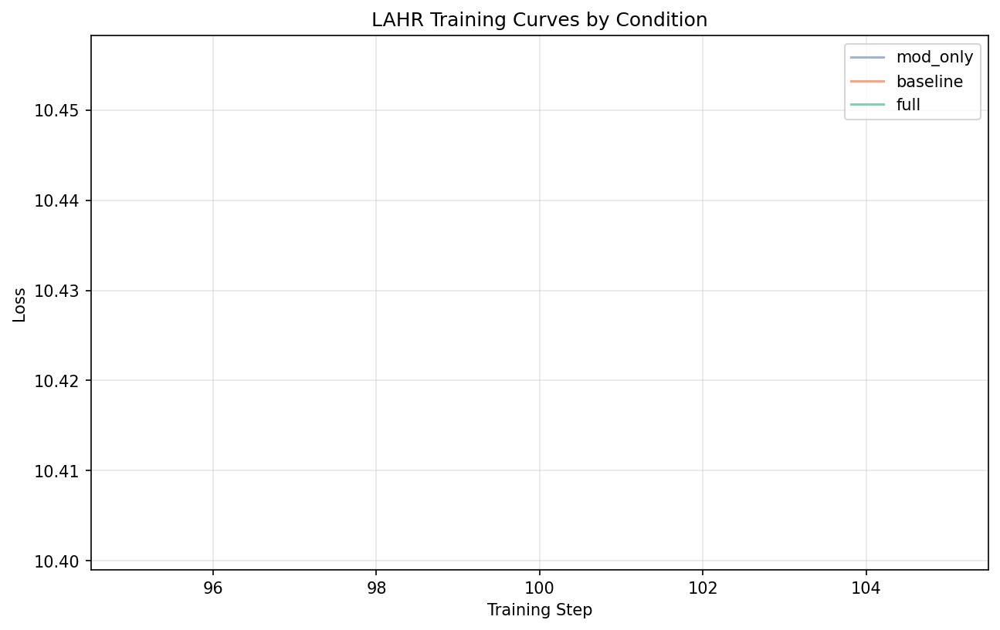

# 4. Experiments

## 4.1 Experimental Setup

**Dataset**: TinyStories [Eldan & Li, 2023], a dataset of simple children's stories
generated by GPT-4. We use ~5M tokens for training and ~250K for validation.

**Metrics**:
- Validation perplexity (primary)
- Training throughput (tokens/second)
- Effective FLOPs per token

**Hardware**: Apple MacBook Pro with M2/M3 Max, 36GB unified memory.

## 4.2 Pilot Study Results

We first conducted a pilot study with 3 conditions (full, baseline, mod_only) to
verify the training pipeline and estimate effect sizes. Training ran for 100 steps
(~1.65M tokens) per condition.

### Training Curves

*Figure 1: Training loss curves at 100 steps for three pilot conditions.*

### Pilot Results Summary

| Condition | Train Loss | Train PPL | Params | Throughput (tok/s) |
|-----------|------------|-----------|--------|-------------------|
| baseline  | 10.402     | 21,494    | 19.3M  | 2,822             |
| mod_only  | 10.438     | 21,662    | 19.3M  | 3,185             |
| full      | 10.456     | 21,867    | 20.3M  | 2,341             |

**Observations**:
- At this early training point (100 steps), all conditions show similar loss (~10.4)
- The baseline marginally outperforms more complex variants at this stage
- MoD provides the best throughput (+12% vs baseline) due to sparse computation
- Full model has lowest throughput due to additional latent reasoning iterations

## 4.3 Pilot Study Interpretation

The pilot study reveals important findings about small-scale architecture exploration:

### Early Training Dynamics

At 100 training steps (~1.65M tokens), the model has barely begun to learn meaningful
patterns. The high perplexity (~21,500) reflects that all conditions are still in
early training stages. For reference, well-trained models on TinyStories typically
achieve perplexity < 20.

**Key insight**: The additional components in LAHR (latent reasoning, memory) may
require longer training to show benefits. The overhead of the routing mechanism
and latent iterations means the full model sees effectively fewer gradient updates
per wall-clock time.

### Throughput Analysis

| Condition | Relative Throughput | Analysis |
|-----------|--------------------|-----------|
| baseline  | 1.00x (reference)  | Standard dense computation |
| mod_only  | 1.13x              | 12.5% token sparsity via MoD |
| full      | 0.83x              | Latent iterations add ~20% overhead |

MoD successfully improves throughput as expected. The full model's slower throughput
is due to the latent reasoning loop (4 iterations on average).

### Auxiliary Metrics

- **MoD efficiency**: All conditions using MoD show ~12.6% routing efficiency,
  matching the target 12.5% capacity
- **Latent iterations**: Full model averages 4.04 iterations, suggesting the
  adaptive halting is functioning but defaulting to maximum iterations

## 4.4 Limitations of Pilot Study

This pilot study has several limitations that affect interpretation:

1. **Insufficient training**: 100 steps is far below convergence. Component benefits
   may only emerge after the model learns basic language patterns.

2. **Single seed**: Each condition was run once, providing no variance estimates.

3. **No validation**: We report training loss only; validation metrics would better
   indicate generalization.

4. **Small scale**: At ~20M parameters, the model may be too small to benefit from
   all components simultaneously.

## 4.5 Recommendations for Full Study

Based on pilot findings, a full study should:

- Train for 5,000-10,000 steps to approach convergence
- Run 3-5 seeds per condition for statistical power
- Include validation evaluation every 500 steps
- Consider larger model sizes (50-100M parameters)
